---
## Front matter
title: "Лабораторная работа-04"
subtitle: "Основы интерфейса взаимодействия
пользователя с системой Unix на уровне командной строки"
author: "Бровкин Александр НБИбд-01-21"

## Generic otions
lang: ru-RU
toc-title: "Содержание"

## Bibliography
bibliography: bib/cite.bib
csl: pandoc/csl/gost-r-7-0-5-2008-numeric.csl

## Pdf output format
toc: true # Table of contents
toc-depth: 2
lof: true # List of figures
lot: true # List of tables
fontsize: 12pt
linestretch: 1.5
papersize: a4
documentclass: scrreprt
## I18n polyglossia
polyglossia-lang:
  name: russian
  options:
	- spelling=modern
	- babelshorthands=true
polyglossia-otherlangs:
  name: english
## I18n babel
babel-lang: russian
babel-otherlangs: english
## Fonts
mainfont: PT Serif
romanfont: PT Serif
sansfont: PT Sans
monofont: PT Mono
mainfontoptions: Ligatures=TeX
romanfontoptions: Ligatures=TeX
sansfontoptions: Ligatures=TeX,Scale=MatchLowercase
monofontoptions: Scale=MatchLowercase,Scale=0.9
## Biblatex
biblatex: true
biblio-style: "gost-numeric"
biblatexoptions:
  - parentracker=true
  - backend=biber
  - hyperref=auto
  - language=auto
  - autolang=other*
  - citestyle=gost-numeric
## Pandoc-crossref LaTeX customization
figureTitle: "Рис."
tableTitle: "Таблица"
listingTitle: "Листинг"
lofTitle: "Список иллюстраций"
lotTitle: "Список таблиц"
lolTitle: "Листинги"
## Misc options
indent: true
header-includes:
  - \usepackage{indentfirst}
  - \usepackage{float} # keep figures where there are in the text
  - \floatplacement{figure}{H} # keep figures where there are in the text
---

# Цель работы

Приобретение практических навыков взаимодействия пользователя с системой по-
средством командной строки.

# Выполнение лабораторной работы

1. Определите полное имя вашего домашнего каталога. Далее относительно этого каталога будут выполняться последующие упражнения.
2. Выполните следующие действия:
2.1. Перейдите в каталог /tmp.
2.2. Выведите на экран содержимое каталога /tmp. Для этого используйте команду ls
с различными опциями. Поясните разницу в выводимой на экран информации.
2.3. Определите, есть ли в каталоге /var/spool подкаталог с именем cron?
2.4. Перейдите в Ваш домашний каталог и выведите на экран его содержимое. Опре-
делите, кто является владельцем файлов и подкаталогов?
3. Выполните следующие действия:
3.1. В домашнем каталоге создайте новый каталог с именем newdir.
3.2. В каталоге ~/newdir создайте новый каталог с именем morefun.
3.3. В домашнем каталоге создайте одной командой три новых каталога с именами
letters, memos, misk. Затем удалите эти каталоги одной командой.
3.4. Попробуйте удалить ранее созданный каталог ~/newdir командой rm. Проверьте,
был ли каталог удалён.
3.5. Удалите каталог ~/newdir/morefun из домашнего каталога. Проверьте, был ли
каталог удалён.
4. С помощью команды man определите, какую опцию команды ls нужно использо-
вать для просмотра содержимое не только указанного каталога, но и подкаталогов,
входящих в него.
5. С помощью команды man определите набор опций команды ls, позволяющий отсорти-
ровать по времени последнего изменения выводимый список содержимого каталога
с развёрнутым описанием файлов.
6. Используйте команду man для просмотра описания следующих команд: cd, pwd, mkdir,
rmdir, rm. Поясните основные опции этих команд.
7. Используя информацию, полученную при помощи команды history, выполните мо-
дификацию и исполнение нескольких команд из буфера команд.

НАЧАЛО

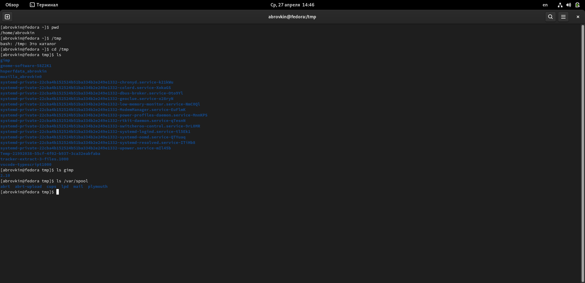

Определяю, если ли в каталогах подкаталог с именем cron, его нет.
А также создам одной командой три новых каталога, а потом удалю ранее созданый каталог newdir

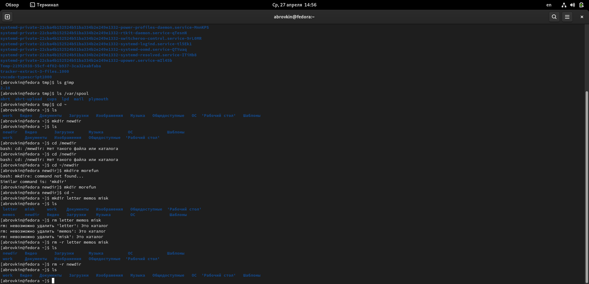

С помощью команды man определяю опции команды ls, cd, pwd, mkdir, rmdir, rm.

Разница в выводимой на экран информации:
Команда ls выводит содержимое каталога.
Команда ls -l выводит подробный список, в котором будет отображаться владелец, группа, дата создания, размер и другие параметры.
Команда ls -F показывает тип объекта.

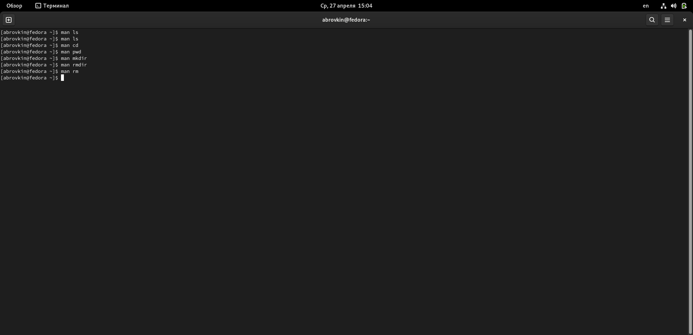

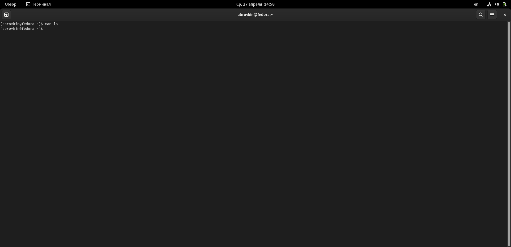

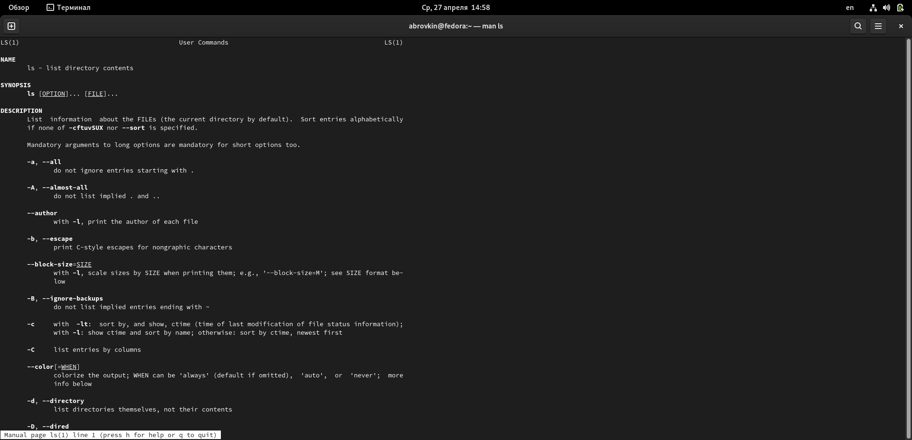

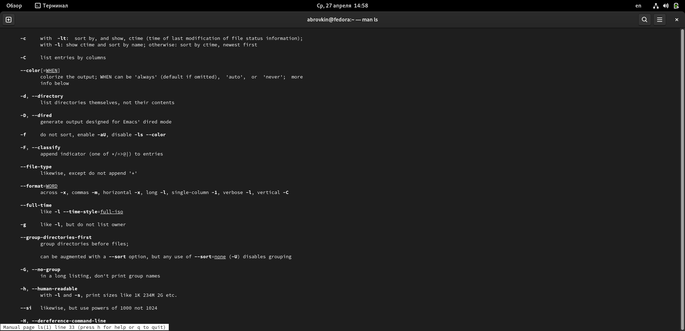

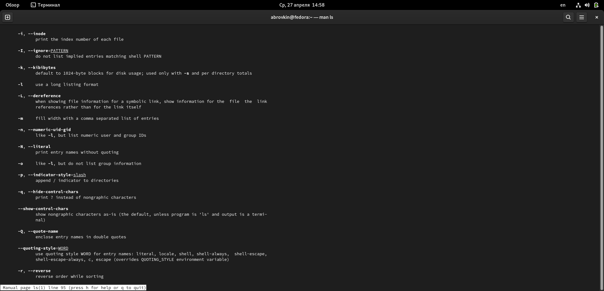

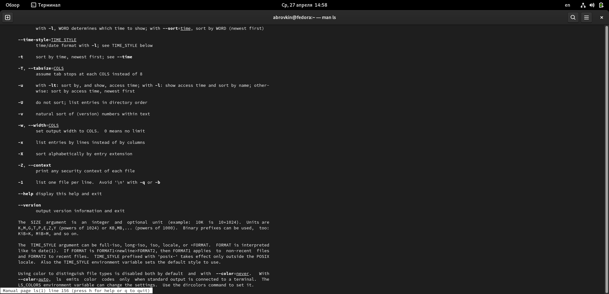

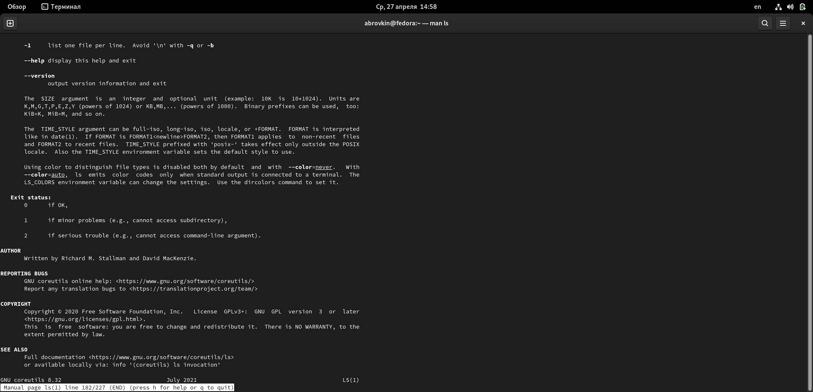

С помощью команды man определил, какую опцию команды ls нужно использовать для просмотра содержимого не только указанного каталога, но и подкаталогов, входящих в него.
А именно: -R, --recursive
list subdirectories recursively
           
С помощью команды man определил набор опций команды ls, позволяющий отсортировать по времени последнего изменения выводимый список содержимого каталога с развёрнутым описанием файлов.
А именно: --time-style=TIME STYLE
-t
-T
-u

Использовал команду man для просмотра описания следующих команд: cd, pwd,
mkdir, rmdir, rm. 

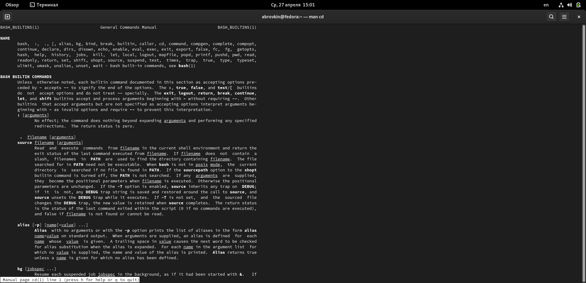

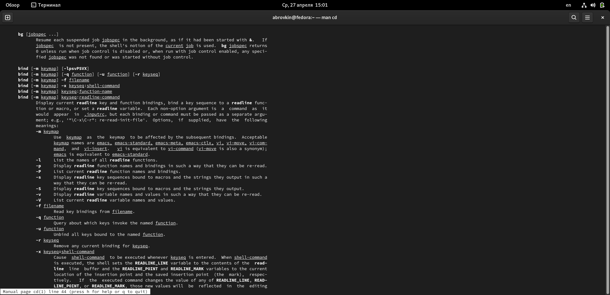

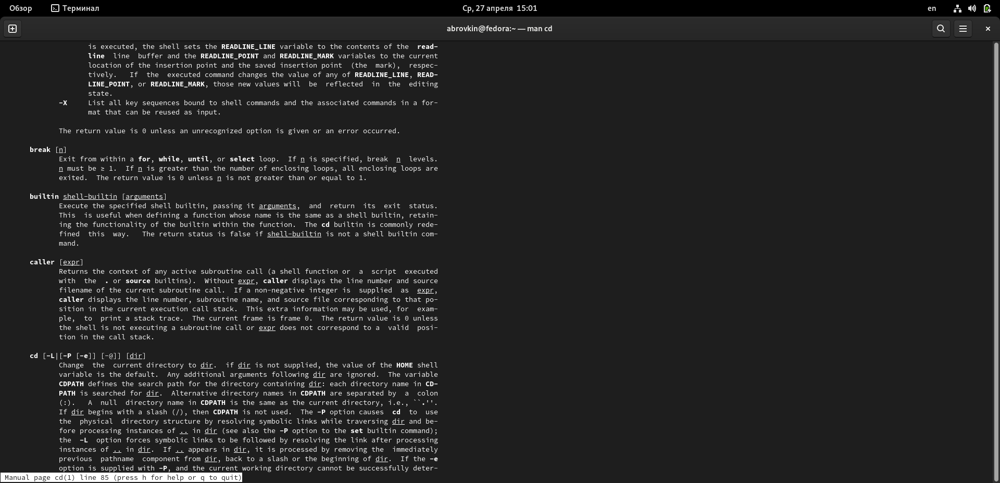

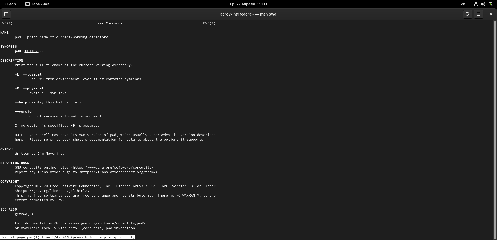

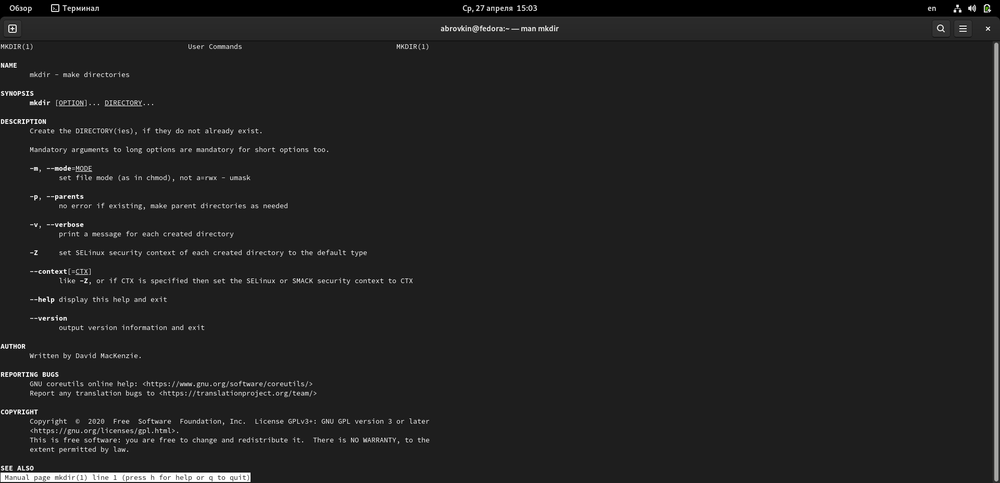

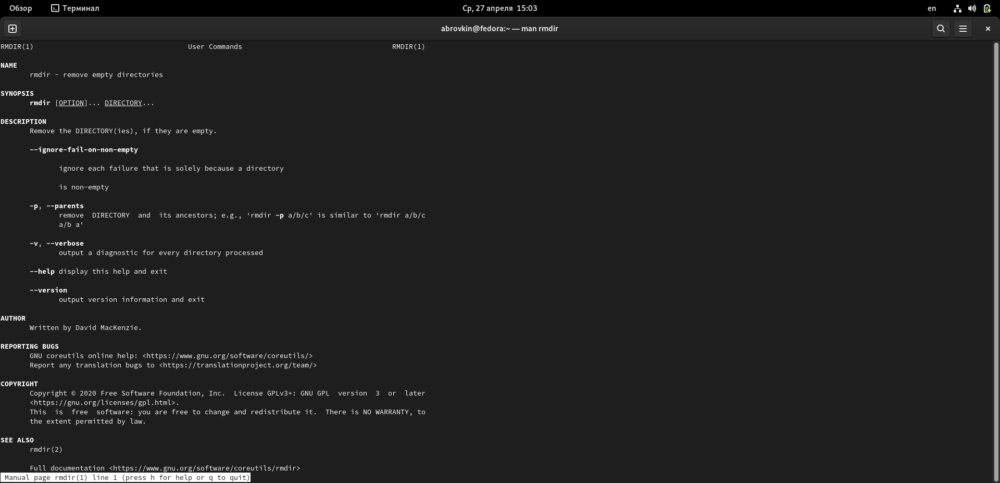

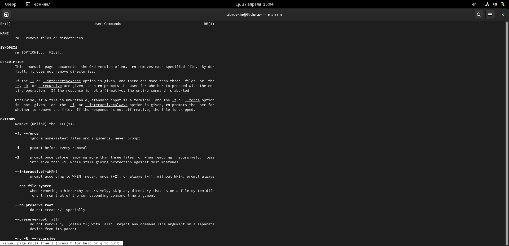

Основные опции этих команд:
cd – команда перемещения по файловой системе.
pwd – команда показывающая директорию, в которой находится пользователь.
mkdir – команда, создающая новую директорию.
rmdir – команда, удаляющая файлы, которые должны быть пустыми.
rm - команда, удаляющая файлы или целые деревья каталогов.

Используя информацию, полученную при помощи команды history, выполнил
модификацию и исполнение нескольких команд из буфера команд.
Команда history

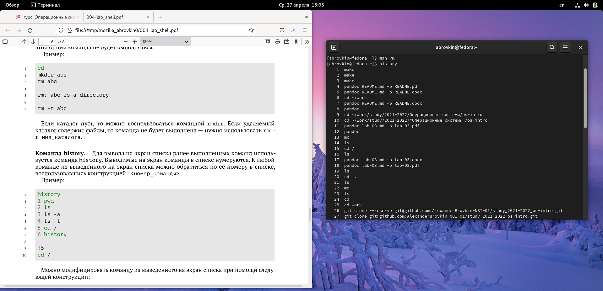

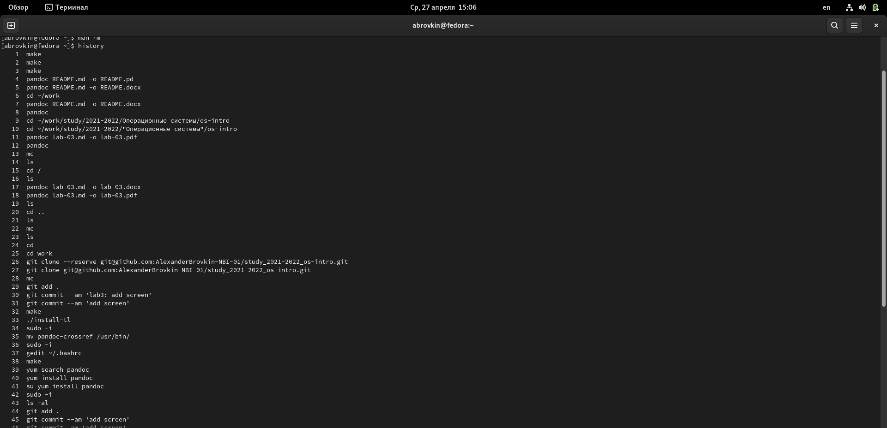

пример:
!8
СВ
!8:s/d/b
cb

# Вывод

Мы приобрели практические навыки взаимодействия пользователя с системой посредством командной строки.

# Контрольные вопросы

1. Что такое командная строка?

2. При помощи какой команды можно определить абсолютный путь текущего каталога?
Приведите пример.

3. При помощи какой команды и каких опций можно определить только тип файлов
и их имена в текущем каталоге? Приведите примеры.

4. Каким образом отобразить информацию о скрытых файлах? Приведите примеры.

5. При помощи каких команд можно удалить файл и каталог? Можно ли это сделать
одной и той же командой? Приведите примеры.

6. Каким образом можно вывести информацию о последних выполненных пользовате-
лем командах? работы?

7. Как воспользоваться историей команд для их модифицированного выполнения? При-
ведите примеры.

8. Приведите примеры запуска нескольких команд в одной строке.

9. Дайте определение и приведите примера символов экранирования.

10. Охарактеризуйте вывод информации на экран после выполнения команды ls с опцией
l.
11. Что такое относительный путь к файлу? Приведите примеры использования относительного и абсолютного пути при выполнении какой-либо команды.

12. Как получить информацию об интересующей вас команде?

13. Какая клавиша или комбинация клавиш служит для автоматического дополнения
вводимых команд?

# Ответы на контрольные вопросы:

1.Интерфейс командной строки - управление программами с помощью команд. Команды состоят из букв, цифр, символов, набираются построчно, выполняются после нажатия клавиши Enter. Основной инструмент здесь клавиатура. Данный интерфейс встроен в ядро системы, он будет доступен, даже если графический интерфейс не запустится. Добраться до командной строки можно двумя способами: через консоль или терминал.

2.При помощи команды realpath можно определить абсолютный путь текущего каталога. Например, если вбить realpath var на экран выведется /home/<username>/var.

3. При помощи команды ls -F можно определить только тип файлов и их имена в текущем каталоге.
4. Файл (или директория) считается скрытым, если его название начинается с символа точка «.». Например, «.myfile». Обычно такие файлы используются приложениями для хранения настроек, конфигураций и другой информации, которую нужно скрыть от пользователя. Зачастую пользователю требуется отредактировать соответствующий конфигурационный скрытый файл, чтобы настроить какую-нибудь программу, и пользователи сталкиваются с тем, что не знают, как их вообще просмотреть. По умолчанию файловые менеджеры обычно не отображают такие файлы.
Для просмотра списка файлов в командной строке используется команда ls. Чтобы по команде ls также выводились скрытые файлы, существует опция -a.

5. При помощи команд rm и rmdir можно удалить файл и каталог. Это нельзя сделать одной и той же командой. rmdir используется, чтобы удалить файлы, которые должны быть пустые. rm используется, чтобы удалить непустые файлы или целые деревья каталогов.

6. Определить какие команды выполнил пользователь в сеансе работы можно с помощь команды history.

7. Исправить и запустить на выполнение команду, которую пользователь уже использовал в сеансе работы, можно с помощью команды: !<номер_команды>:s/<что_меняем>/<на_что_меняем> Например,
history
.
.
3 ls -a
.
.
!3:s/a/F
ls -F

8. В одной строке можно записать несколько команд. Если требуется выполнить последовательно несколько команд, записанный в одной строке, то для этого используется символ точка с запятой. Пример: cd; ls.
9.Экранирование — это способ заключения в кавычки одиночного символа. Экранирующий символ (\) сообщает интерпретатору, что следующий за ним символ должен восприниматься как обычный символ. Пример:
echo "Привет"                    # Привет
echo "Он сказал: \"Привет\"."    # Он сказал: "Привет".

10. Если используется опция l в команде ls, то на экран выводится подробный список, в котором будет отображаться владелец, группа, дата создания, размер и другая информация о файлах и каталогах.

11. Относительный путь – это путь к файлу относительно текущей папки. При использовании команды pwd на экран выведется относительный путь текущей директории, а при использовании команды realpath на экран выведется абсолютный путь текущей директории.

12. Получить информацию об интересующей вас команде можно с помощью команды man. Например, команда man ls выведет все опции команды ls.

13. Сочетание клавиш Ctrl+C прерывает текущий процесс, запущенный в терминале.

# Список литературы{.unnumbered}

::: {#refs}
:::

1. [Командная строка](http://uii.mpei.ru/study/courses/sdt/16/lecture02.2_vcs.slides.pdf)

