---
## Front matter
lang: ru-RU
title: Инструменты для поиска и фильтрации файлов
author: |
	  Бровкин Александр НБИбд-01-21\inst{1}

institute: |
	\inst{1}Российский Университет Дружбы Народов

date: 29 апреля, 2022, Москва, Россия

## Formatting
mainfont: PT Serif
romanfont: PT Serif
sansfont: PT Sans
monofont: PT Mono
toc: false
slide_level: 2
theme: metropolis
header-includes: 
 - \metroset{progressbar=frametitle,sectionpage=progressbar,numbering=fraction}
 - '\makeatletter'
 - '\beamer@ignorenonframefalse'
 - '\makeatother'
aspectratio: 43
section-titles: true

---

## Цель работы

Ознакомление с инструментами поиска файлов и фильтрации текстовых данных.
Приобретение практических навыков: по управлению процессами (и заданиями), по
проверке использования диска и обслуживанию файловых систем.

## Выполнение лабораторной работы

Записываю в файл file.txt названия файлов, содержащихся в каталоге /etc. Дописываю в этот же файл названия файлов, содержащихся в домашнем каталоге. 

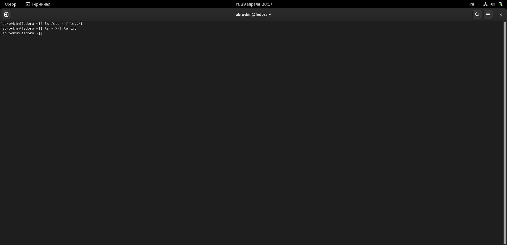

##

Вывожу имена всех файлов из file.txt, имеющих расширение .conf, после чего записал их в новых текстовый файл conf.txt 

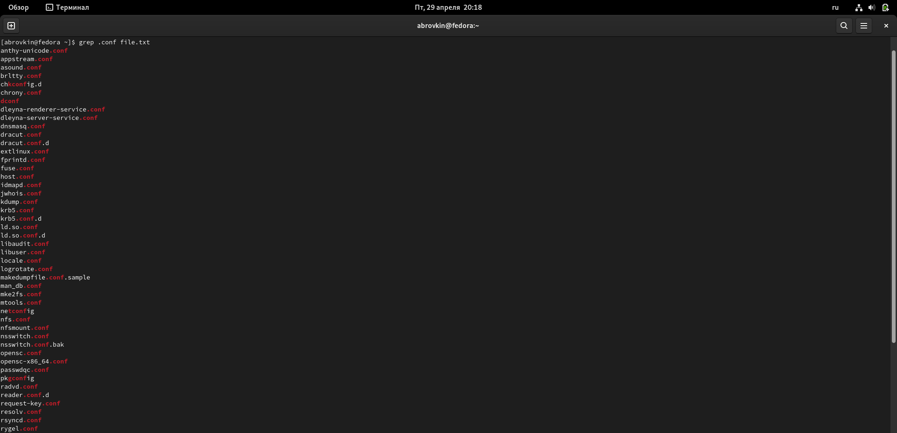

##

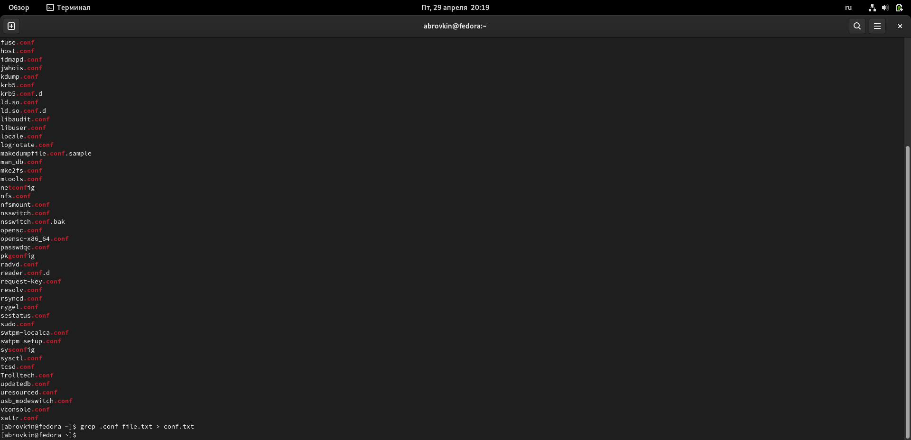

##

Определил, какие файлы в домашнем каталоге имеют имена, которые начинаются с символа с.Привел несколько примеров, как это сделать.

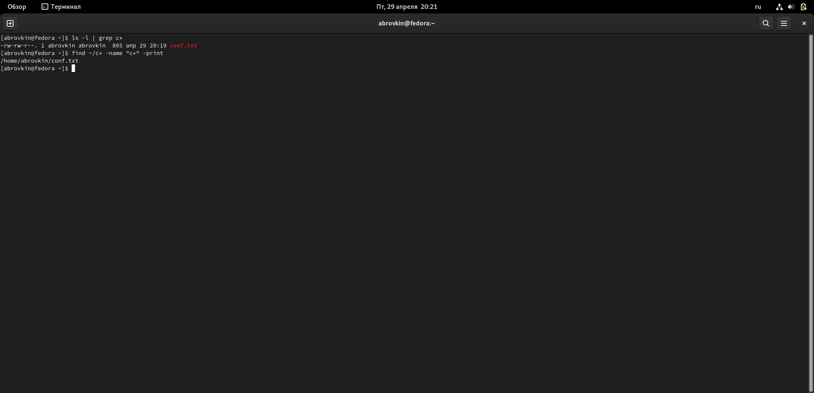

##

Вывел на экран имена файлов из каталога /etc, начинающиеся с символа h.

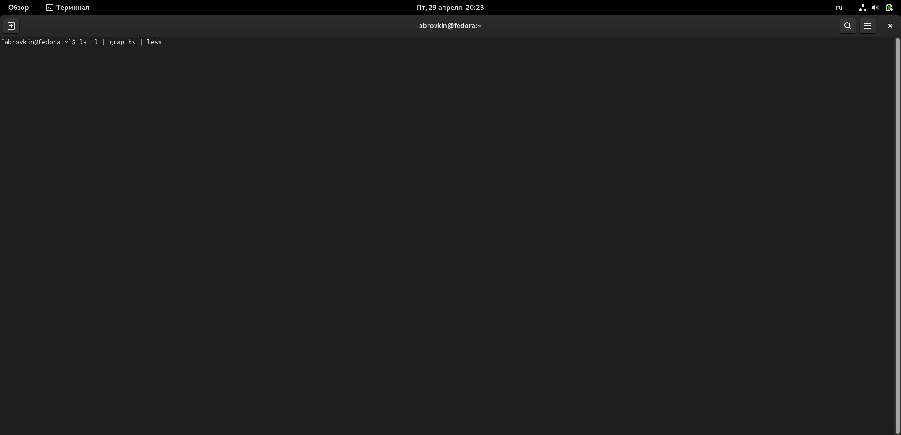

##

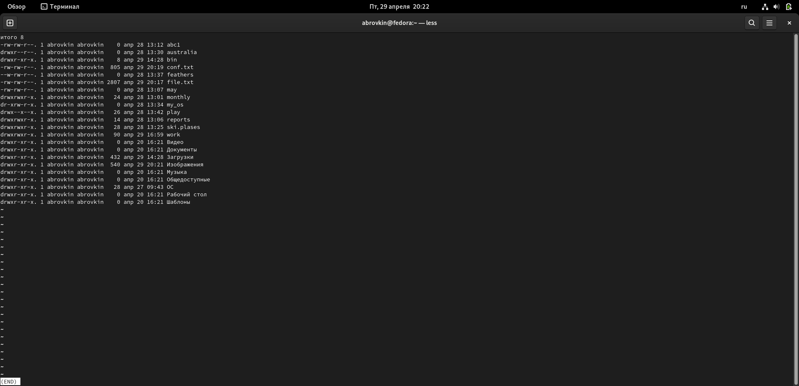

##

Запустил в фоновом режиме процесс, который будет записывать в файл ~/logfile файлы, имена которых начинаются с log.
Удалил файл ~/logfile.

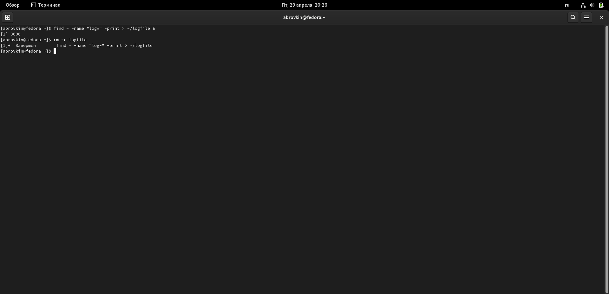

##

Запустил из консоли в фоновом режиме редактор gedit.

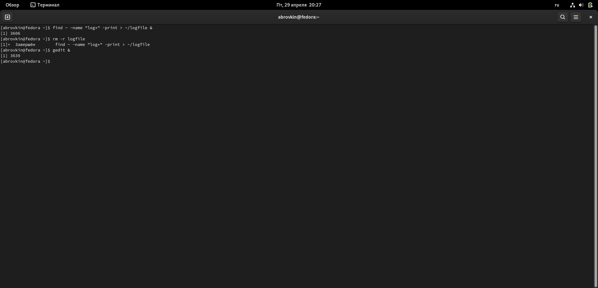

##

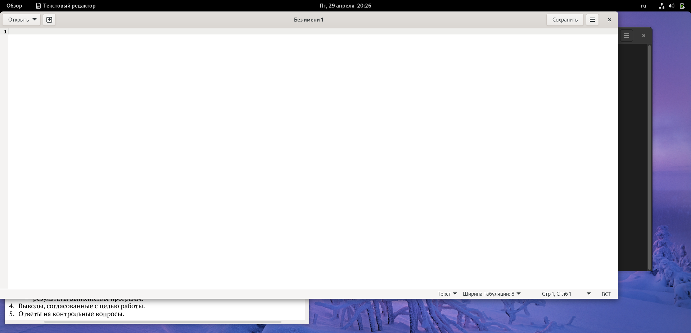

##

Определил идентификатор процесса gedit
Используя команду ps, конвейер и
фильтр grep. Более простым способом определить этот идентификатор не получилось.

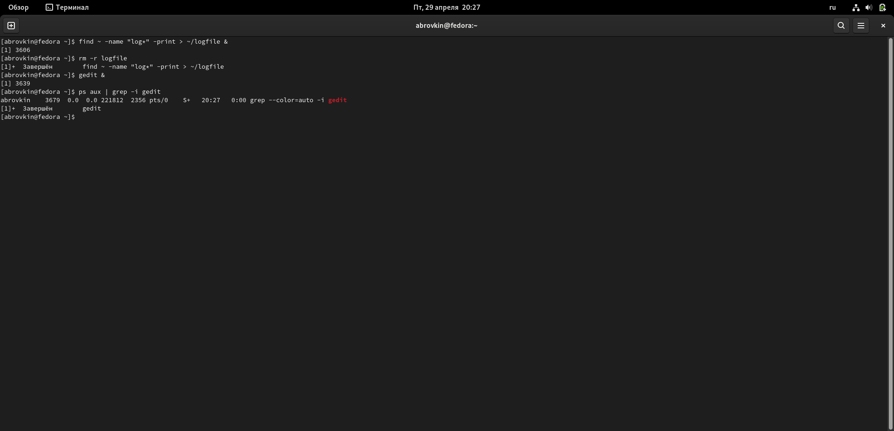

##

Прочел справку (man) команды kill, после чего использовал её для завершения процесса gedit.

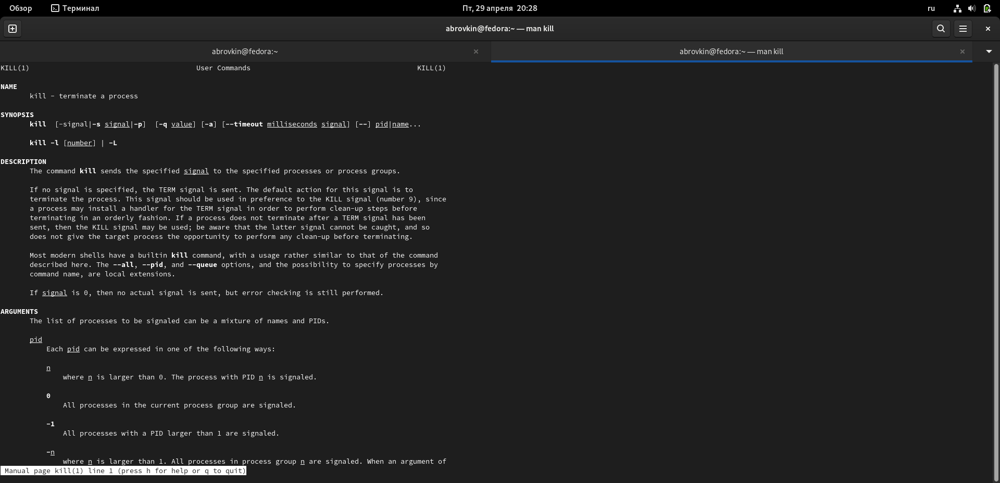

##

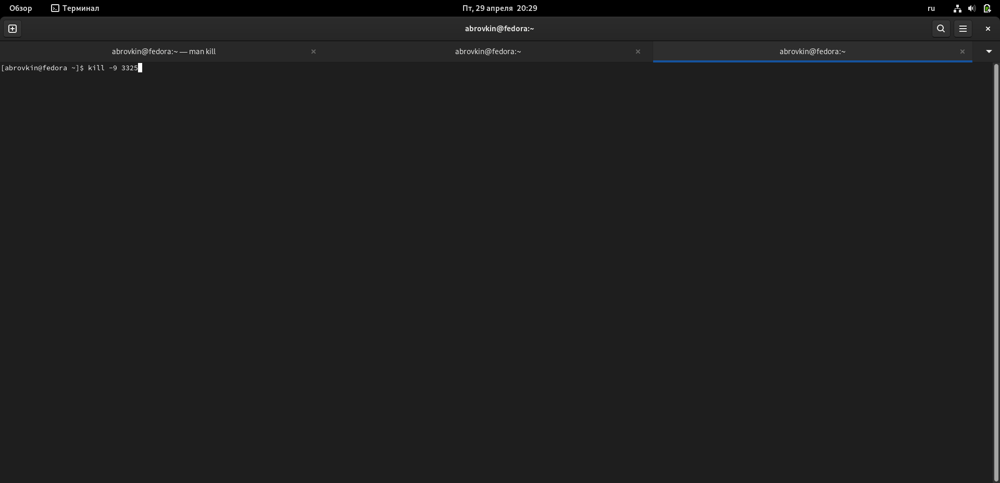

##

Выполнил команды df и du
Предварительно получив более подробную информацию об этих командах, с помощью команды man.

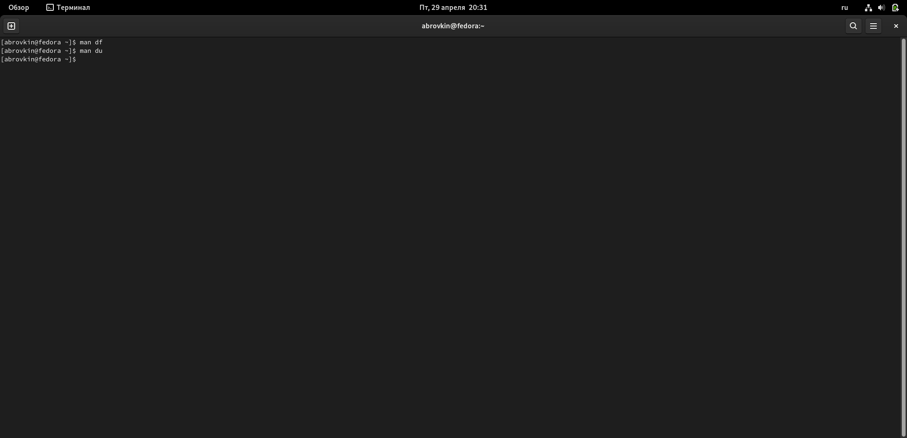

##

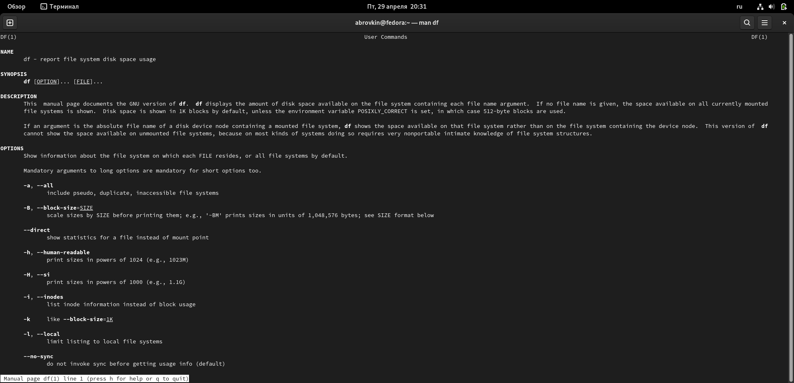

##

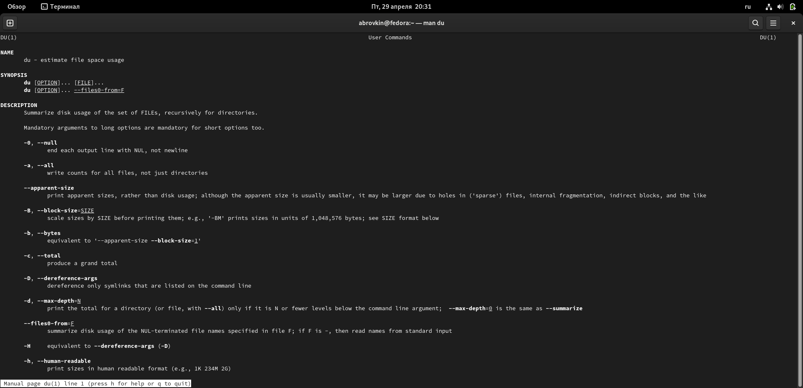

##

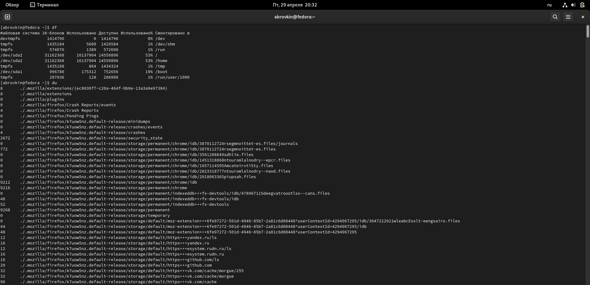

##

Воспользовавшись справкой команды find, вывел имена всех директорий, имеющихся в домашнем каталоге.

##

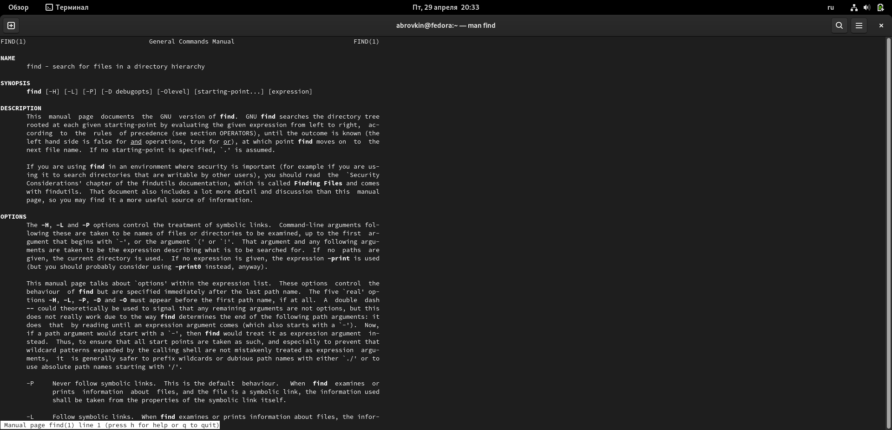

##

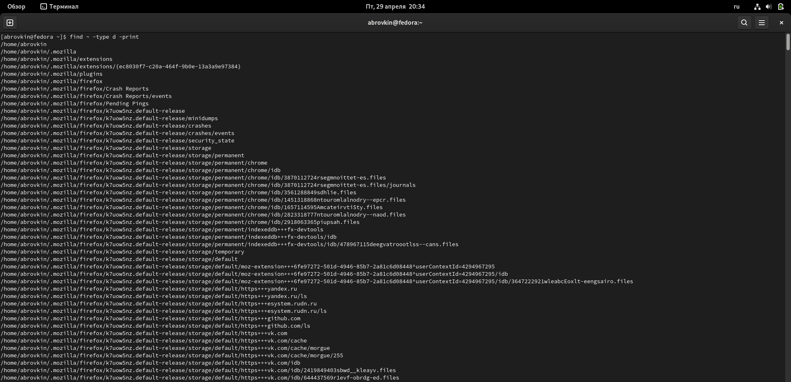

## Выводы
Ознакомилсся с инструментами поиска файлов и фильтрацией текстовых данных, приобрел практические навыки, как по управлению процессами, так и по проверке использования диска и обслуживанию файловых систем.

