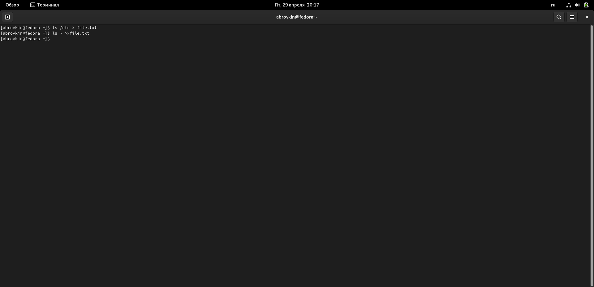
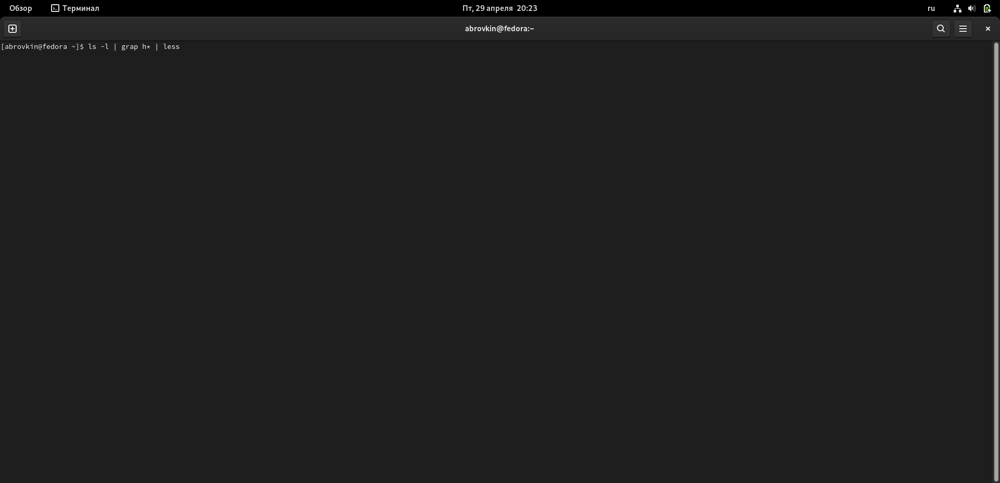
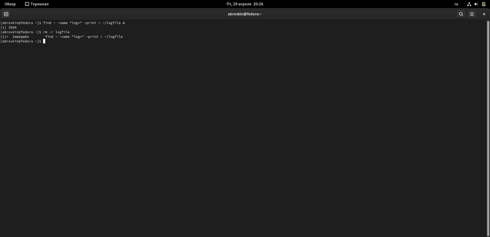
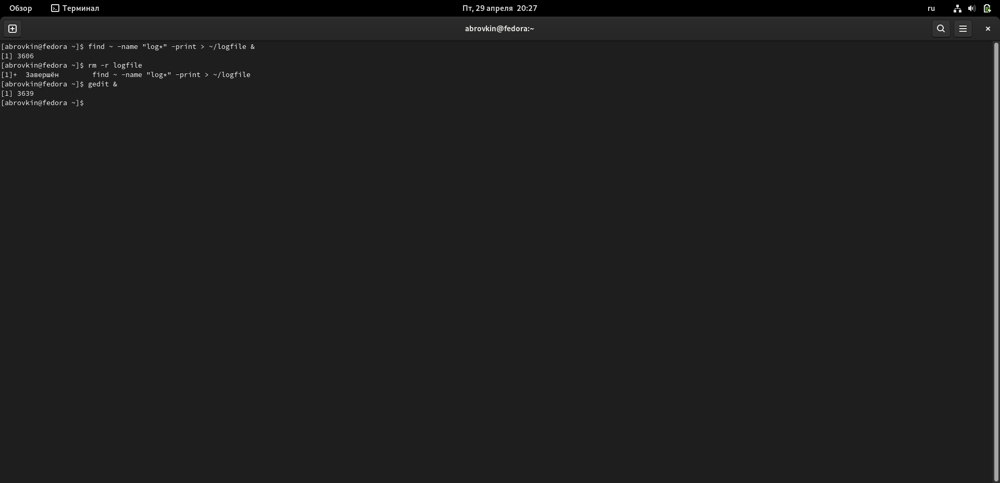
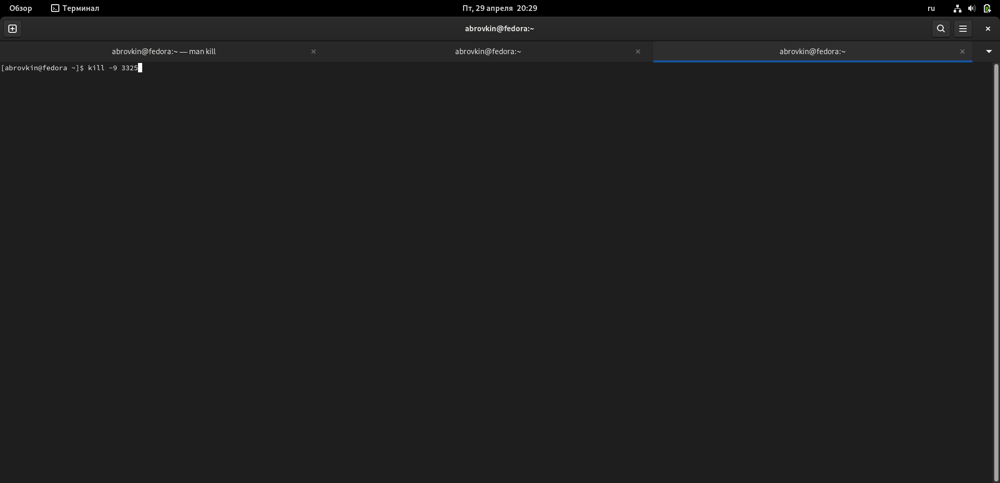
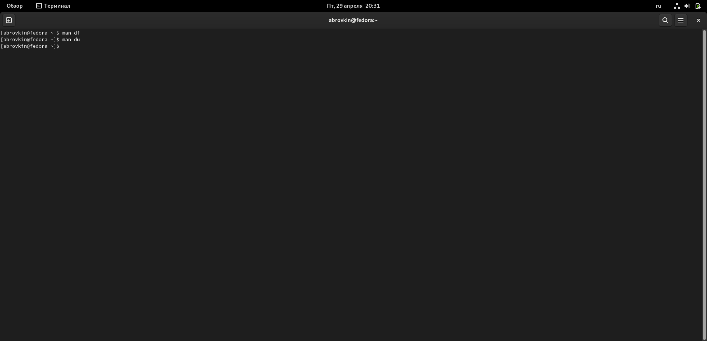
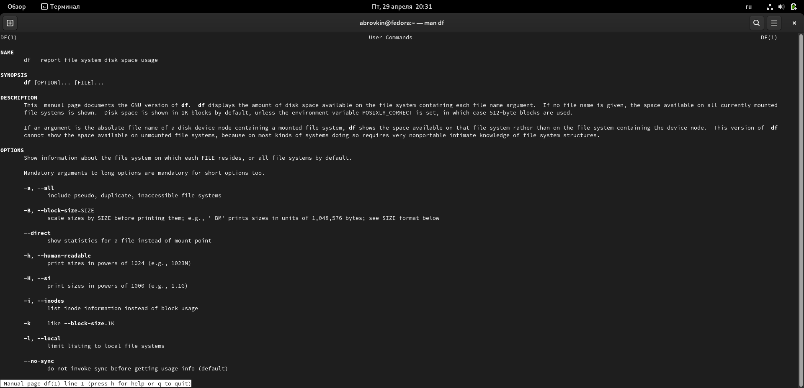
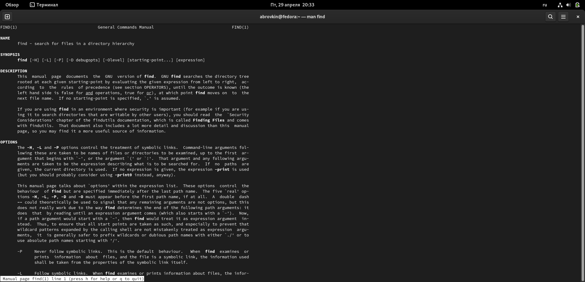
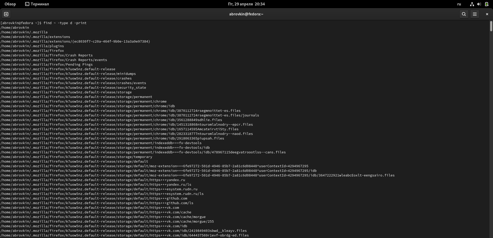

---
## Front matter
title: "Лабораторная работа-06"
subtitle: "Инструкция поиска файлов и фильтрация  текстовых данных"
author: "Бровкин Александр НБИбд-01-21"

## Generic otions
lang: ru-RU
toc-title: "Содержание"

## Bibliography
bibliography: bib/cite.bib
csl: pandoc/csl/gost-r-7-0-5-2008-numeric.csl

## Pdf output format
toc: true # Table of contents
toc-depth: 2
lof: true # List of figures
lot: true # List of tables
fontsize: 12pt
linestretch: 1.5
papersize: a4
documentclass: scrreprt
## I18n polyglossia
polyglossia-lang:
  name: russian
  options:
	- spelling=modern
	- babelshorthands=true
polyglossia-otherlangs:
  name: english
## I18n babel
babel-lang: russian
babel-otherlangs: english
## Fonts
mainfont: PT Serif
romanfont: PT Serif
sansfont: PT Sans
monofont: PT Mono
mainfontoptions: Ligatures=TeX
romanfontoptions: Ligatures=TeX
sansfontoptions: Ligatures=TeX,Scale=MatchLowercase
monofontoptions: Scale=MatchLowercase,Scale=0.9
## Biblatex
biblatex: true
biblio-style: "gost-numeric"
biblatexoptions:
  - parentracker=true
  - backend=biber
  - hyperref=auto
  - language=auto
  - autolang=other*
  - citestyle=gost-numeric
## Pandoc-crossref LaTeX customization
figureTitle: "Рис."
tableTitle: "Таблица"
listingTitle: "Листинг"
lofTitle: "Список иллюстраций"
lotTitle: "Список таблиц"
lolTitle: "Листинги"
## Misc options
indent: true
header-includes:
  - \usepackage{indentfirst}
  - \usepackage{float} # keep figures where there are in the text
  - \floatplacement{figure}{H} # keep figures where there are in the text
---

# Цель работы

Ознакомление с инструментами поиска файлов и фильтрации текстовых данных.
Приобретение практических навыков: по управлению процессами (и заданиями), по
проверке использования диска и обслуживанию файловых систем.

# Задание

1. Осуществите вход в систему,используя соответствующее имя пользователя.

2. Запишите в файл file.txt названия файлов,содержащихся в каталоге /etc.Допишите в этот же файл названия файлов,содержащихся в вашем домашнем каталоге.
3. Выведите имена всех файлов из file.txt,имеющих расширение .conf,после чего
запишите их в новыйтекстовой файл conf.txt.

4. Определите,какие файлы в вашем домашнем каталоге имеют имена,начинавшиеся
с символа c? Предложите несколько вариантов,как это сделать.

5. Выведите на экран (по странично) имена файлов из каталога /etc,начинающиеся
с символа h.

6. Запустите в фоновом режиме процесс,который будетзаписывать в файл ~/logfile
файлы,имена которых начинаются с log.

7. Удалите файл ~/logfile.

8. Запустите из консоли в фоновом режиме редактор gedit.

9. Определитеидентификаторпроцессаgedit,используякомандуps,конвейерифильтр
grep.Как ещё можно определить идентификатор процесса?

10. Прочтите справку (man) команды kill, после чего используйте её для завершения
процесса gedit.

11. Выполните команды df и du,предварительно получив более подробную информацию
об этих командах,с помощью команды man.

12. Воспользовавшись справкой команды find,выведите имена всех директорий,имеющихся в вашем домашнем каталоге.

# Выполнение лабораторной работы

Вошел в систему, используя свой пароль.
Записываю в файл file.txt названия файлов, содержащихся в каталоге /etc. Дописываю в этот же файл названия файлов, содержащихся в домашнем каталоге. (рис. [-@fig:001])

{ #fig:001 width=70% }

Вывожу имена всех файлов из file.txt, имеющих расширение .conf, после чего записал их в новых текстовый файл conf.txt (рис. [-@fig:002]) (рис. [-@fig:003])

{ #fig:002 width=70% }

{ #fig:003 width=70% }

Определил, какие файлы в домашнем каталоге имеют имена, которые начинаются с символа с.Привел несколько примеров, как это сделать.(рис. [-@fig:004])

{ #fig:004 width=70% }

Вывел на экран имена файлов из каталога /etc, начинающиеся с символа h.(рис. [-@fig:005]) (рис. [-@fig:006])

{ #fig:005 width=70% }

{ #fig:006 width=70% }

Запустил в фоновом режиме процесс, который будет записывать в файл ~/logfile файлы, имена которых начинаются с log. (рис. [-@fig:007])
Удалил файл ~/logfile.

{ #fig:007 width=70% }

Запустил из консоли в фоновом режиме редактор gedit.(рис. [-@fig:008]) (рис. [-@fig:009])

{ #fig:008 width=70% }

{ #fig:009 width=70% }

Определил идентификатор процесса gedit
Используя команду ps, конвейер и
фильтр grep. Более простым способом определить этот идентификатор не получилось.(рис. [-@fig:010])

{ #fig:010 width=70% }

Прочел справку (man) команды kill, после чего использовал её для завершения процесса gedit.(рис. [-@fig:011]) (рис. [-@fig:012])

{ #fig:011 width=70% }

{ #fig:012 width=70% }

Выполнил команды df и du
Предварительно получив более подробную информацию об этих командах, с помощью команды man.(рис. [-@fig:013]) (рис. [-@fig:014]) (рис. [-@fig:015]) (рис. [-@fig:016])

{ #fig:013 width=70% }

{ #fig:014 width=70% }

{ #fig:015 width=70% }

{ #fig:016 width=70% }

Воспользовавшись справкой команды find, вывел имена всех директорий, имеющихся в домашнем каталоге.(рис. [-@fig:017]) (рис. [-@fig:018]) (рис. [-@fig:019])

{ #fig:017 width=70% }

{ #fig:018 width=70% }

{ #fig:019 width=70% }

# Выводы
Ознакомилсся с инструментами поиска файлов и фильтрацией текстовых данных, приобрел практические навыки, как по управлению процессами, так и по проверке использования диска и обслуживанию файловых систем.

# Контрольные вопросы
1. Какие потоки ввода вывода вы знаете?

2. Объясните разницу между операцией > и >>.

3. Чтотакое конвейер?

4. Чтотакое процесс? Чем это понятие отличается от программы?

5. Чтот акое PID и GID?

6. Чтотакое задачи и какая команда позволяет ими управлять?

7. Найдите информацию об утилитах top и htop.Каковы их функции?

8. Назовите и дайте характеристику команде поиска файлов.Приведите примеры ис-
пользования этой команды.

9. Можно ли по контексту (содержанию) найти файл? Если да,то как?

10. Как определить объем свободной памяти на жёстком диске?

11. Как определить объем вашего домашнего каталога?

12. Как удалить зависший процесс?

# Отвeты на вопросы

1. В системе по умолчанию открыто три специальных потока:
– stdin — стандартный поток ввода (по умолчанию: клавиатура), файловый дескриптор 0;
– stdout — стандартный поток вывода (по умолчанию: консоль), файловый дескриптор 1;
– stderr — стандартный поток вывод сообщений об ошибках (по умолчанию: консоль), файловый дескриптор 2.

2. > - перенаправление stdout (вывода) в файл. Если файл отсутствовал, то он создаётся, иначе - перезаписывается.

>> - перенаправление stdout (вывода) в файл. Если файл отсутствовал, то он создаётся, иначе - добавляется.

3. Конвейер (pipe) служит для объединения простых команд или утилит в цепочки,
в которых результат работы предыдущей команды передаётся последующей.

4. Процесс это - совокупность программного кода и данных, загруженных в память ЭВМ. Любой команде, выполняемой в системе, присваивается идентификатор процесса (process ID). Получить информацию о процессе и управлять им, пользуясь
идентификатором процесса, можно из любого окна командного интерпретатора. Процессом называют выполняющуюся программу и все её элементы: адресное пространство, глобальные переменные, регистры, стек, открытые файлы и так далее.

5. PID — уникальный номер (идентификатор) процесса в многозадачной ОС.
GID – идентификатор группы.

6. Любую выполняющуюся в консоли команду или внешнюю программу можно запустить в фоновом режиме. Запущенные фоном программы называются задачами (jobs). Ими можно управлять с помощью команды jobs, которая выводит список запущенных в данный момент задач. Для завершения задачи необходимо выполнить команду kill %номер задачи.

7. Команда top в Linux системах позволяет вывести в виде таблицы перечень запущенных процессов и оценить, какой объем ресурсов они потребляют, т.е., какую нагрузку создают на сервер и дисковую подсистему.
Команда htop — продвинутый монитор процессов, показывает динамический список системных процессов, список обычно выравнивается по использованию ЦПУ. В отличие от top, htop показывает все процессы в системе. Также показывает время непрерывной работы, использование процессоров и памяти. htop часто применяется в тех случаях, когда информации даваемой утилитой top недостаточно, например при поиске утечек памяти в процессах.

8. Команда find используется для поиска и отображения имён файлов, соответствующих заданной строке символов. Формат команды: find путь [-опции]
Путь определяет каталог, начиная с которого по всем подкаталогам будет вестись
поиск. Примеры:
- вывести на экран имена файлов из вашего домашнего каталога и его подкаталогов, начинающихся на f: find ~ -name "f*" -print
- вывести на экран имена файлов в каталоге /etc, начинающихся с символа p:
find /etc -name "p*" -print
- найти в вашем домашнем каталоге файлы, имена которых заканчиваются символом и удалить их: find ~ -name "*~" -exec rm "{}" \;

9. Найти файл по контексту (содержанию) позволяет команда grep. 
Формат команды: grep строка имя_файла
Примеры:
- показать строки во всех файлах в вашем домашнем каталоге с именами, начинающимися на f, в которых есть слово begin: grep begin f*
- найти в текущем каталоге все файлы, в имени которых есть буквосочетание «лаб»: 
ls -l | grep лаб
10. Определить объем свободной памяти на жёстком диске позволяет команда df.

11. Определить объем домашнего каталога позволяет команда df /home/<user_name>

12. Удалить зависший процесс можно командой kill %номер задачи.

