---
## Front matter
lang: ru-RU
title: Текстовой редактор emacs
author: |
	  Бровкин Александр НБИбд-01-21\inst{1}

institute: |
	\inst{1}Российский Университет Дружбы Народов

date: 4 мая, 2022, Москва, Россия

## Formatting
mainfont: PT Serif
romanfont: PT Serif
sansfont: PT Sans
monofont: PT Mono
toc: false
slide_level: 2
theme: metropolis
header-includes: 
 - \metroset{progressbar=frametitle,sectionpage=progressbar,numbering=fraction}
 - '\makeatletter'
 - '\beamer@ignorenonframefalse'
 - '\makeatother'
aspectratio: 43
section-titles: true

---

## Цель работы

Познакомиться с операционной системой Linux.Получить практические навыки работы с редактором emacs

## Выполнение лабораторной работы

# Создание нового файла с использованием emacs

1.Открыл emacs.

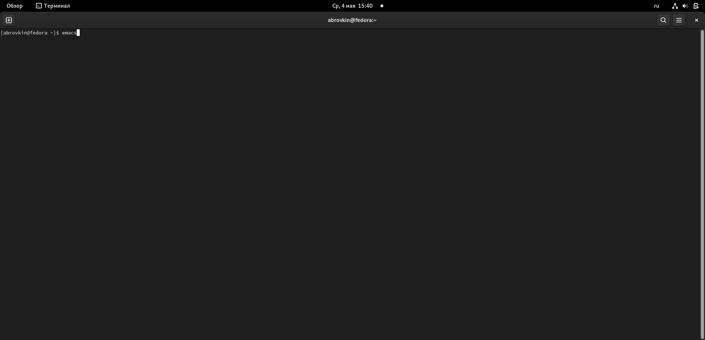}

##

2.Создал файл lab07.sh с помощью комбинации Ctrl-x Ctrl-f (C-x C-f).

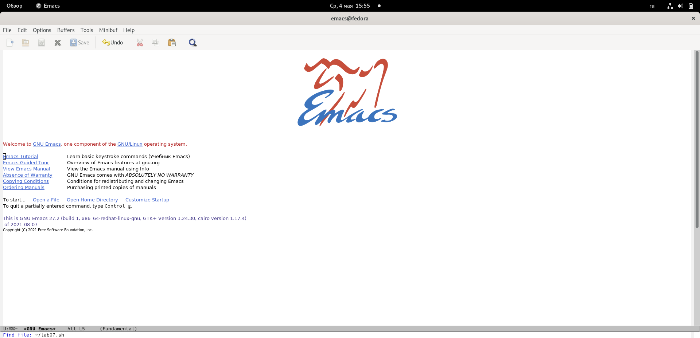

##

3.Набрал текст:(

1 #!/bin/bash

2 HELL=Hello

3 function hello {

4 LOCAL HELLO=World

5 echo $HELLO

6 }

7 echo $HELLO

8 hello

##

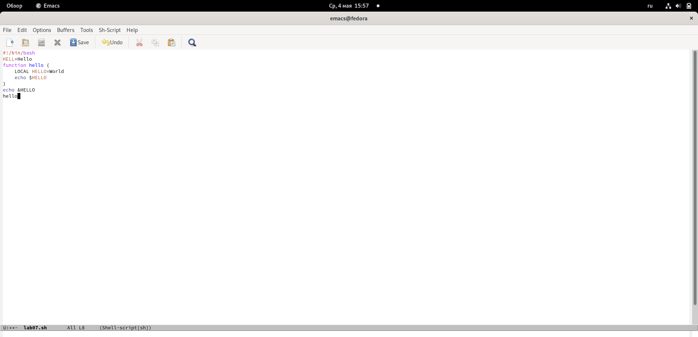

##

4. Сохранил файл с помощью комбинации Ctrl-x Ctrl-s (C-x C-s).

5. Проделал с текстом стандартные процедуры редактирования, каждое действие осуществлялось комбинацией клавиш.

5.1. Вырезал одной командой целую строку (С-k).

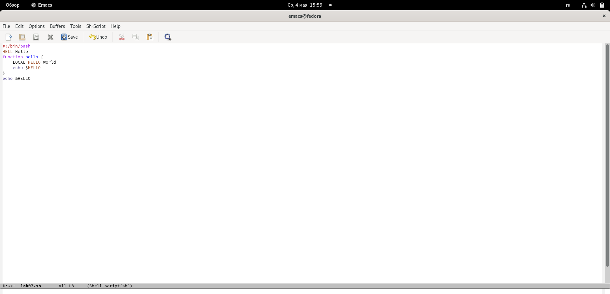

##

5.2. Вставил эту строку в конец файла (C-y).

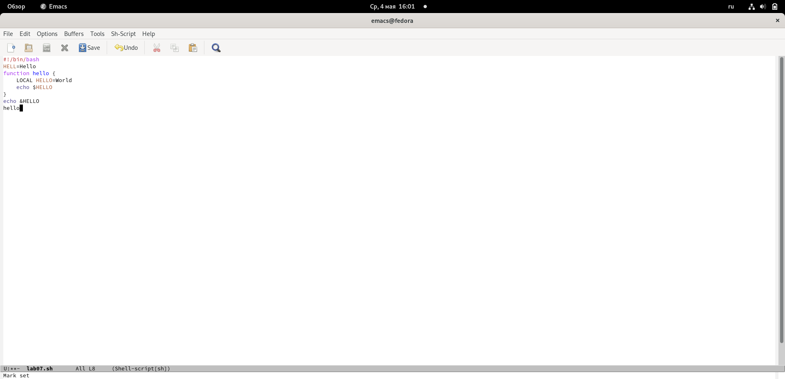

##

5.3. Выделил область текста (C-space).

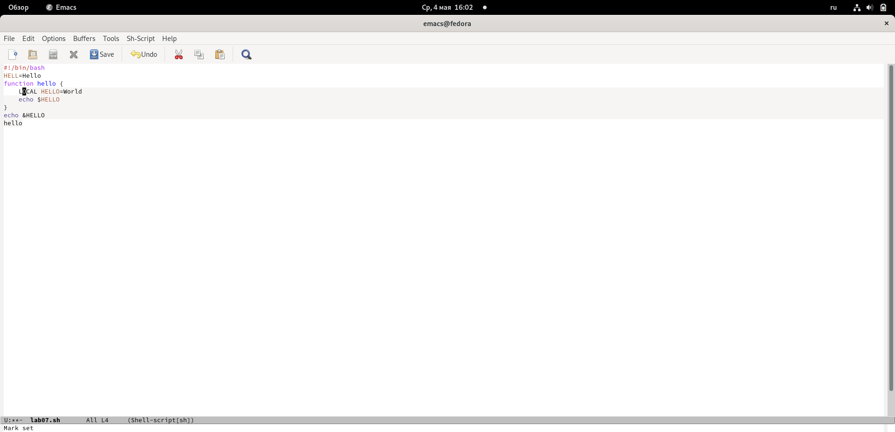

##

5.4. Скопировал область в буфер обмена (M-w).

5.5. Вставил область в конец файла.

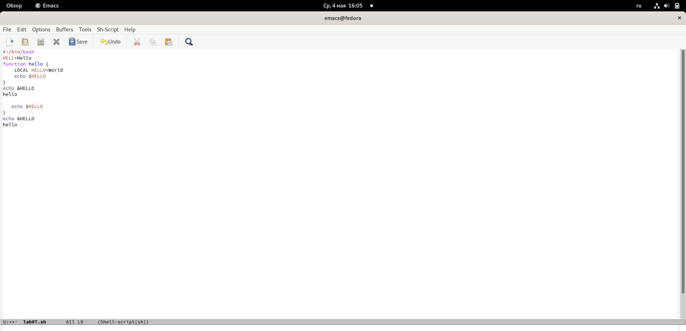

##

5.6. Вновь выделил эту область и на этот раз вырезал её (C-w).
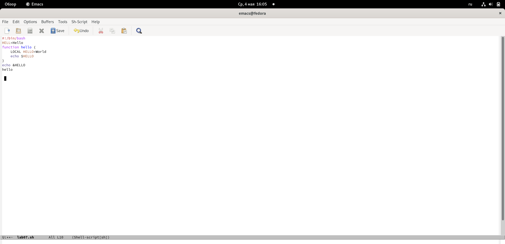

##

5.7. Отменил последнее действие (C-/).

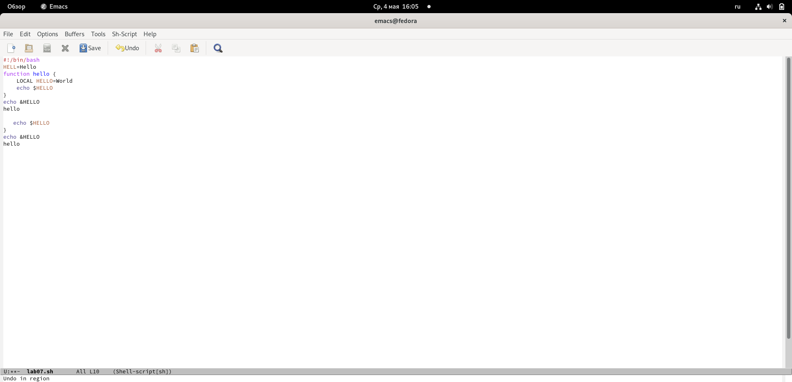

##

6. Научился использовать команды по перемещению курсора.

6.1. Переместил курсор в начало строки (C-a).

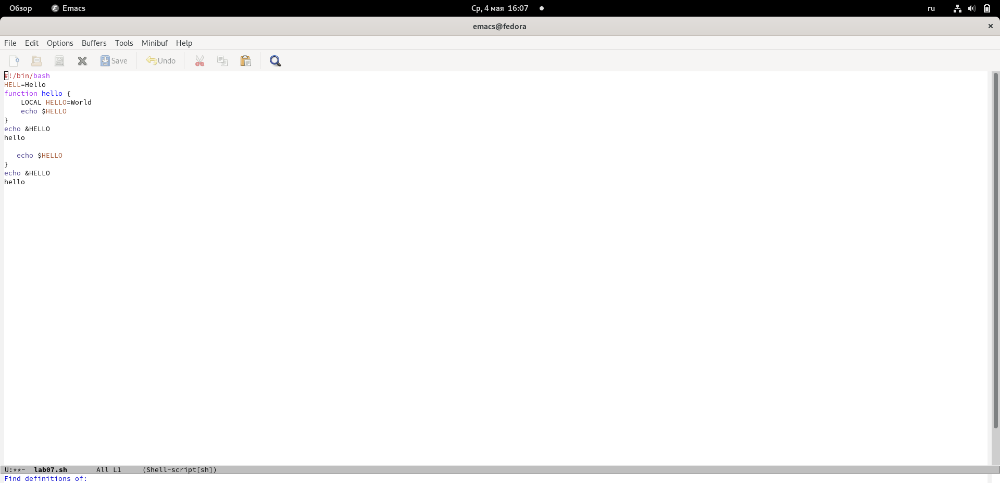

##

6.2. Переместил курсор в конец строки (C-e).

##

Переместил курсор в начало буфера (M-<), а также переместил курсор в конец буфера (M->).

7. Управление буферами.

7.1. Вывел список активных буферов на экран (C-x C-b).

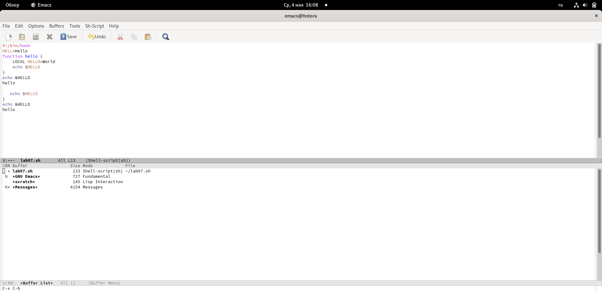

##

7.2. Переместился во вновь открытое окно (C-x)  со списком открытых буферов и переключился на другой буфер.

##

7.3. Закрыл это окно (C-x 0).

 Вновь переключился между буферами, но без вывода их списка на экран (C-x b).

##

8. Управление окнами.

8.1. Поделил фрейм на 4 части: разделил фрейм на два окна по вертикали

(C-x 3), а затем каждое из этих окон на две части по горизонтали (C-x 2)

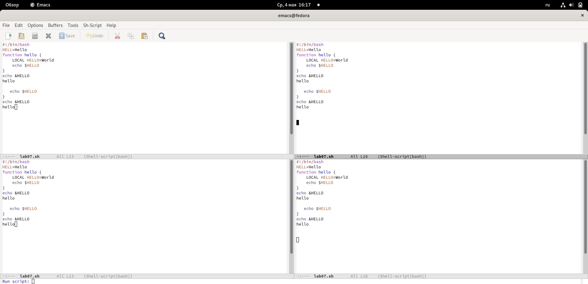

##

8.2. В каждом из четырёх созданных окон открыл новый буфер (файл) и ввел несколько строк текста.

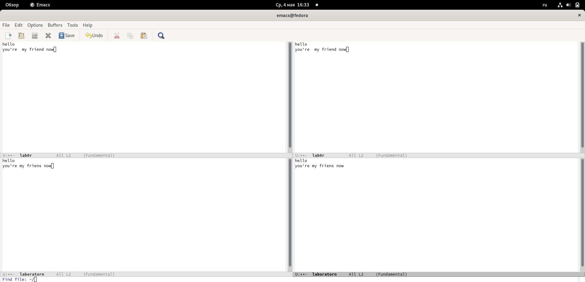

##

9. Режим поиска

9.1. Переключился в режим поиска (C-s) и нашел несколько слов, присутствующих в тексте.(

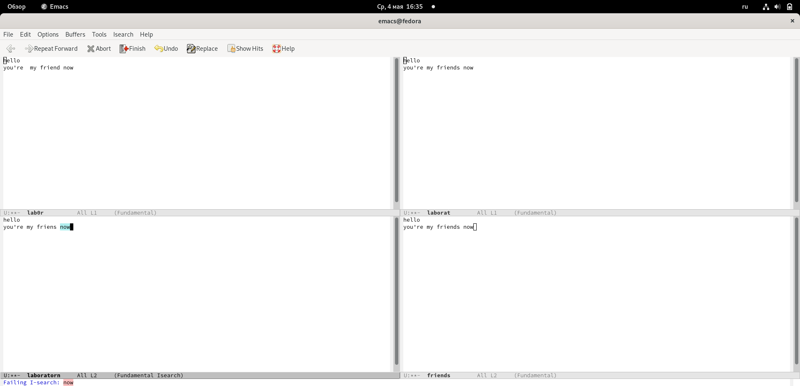

##

9.2. Переключался между результатами поиска, нажимая C-s.

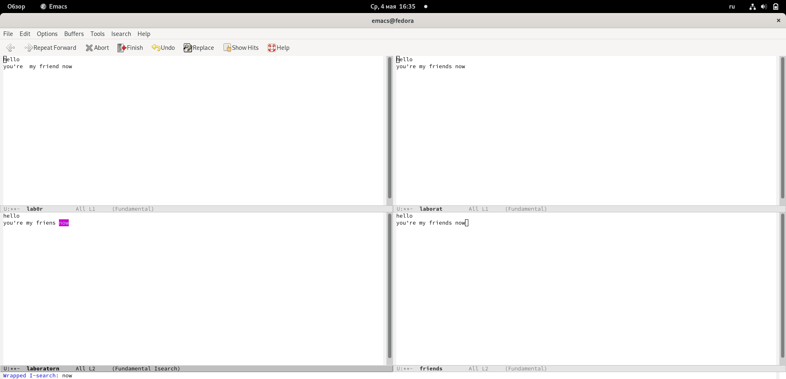

##

9.3. Вышел из режима поиска, нажав C-g.

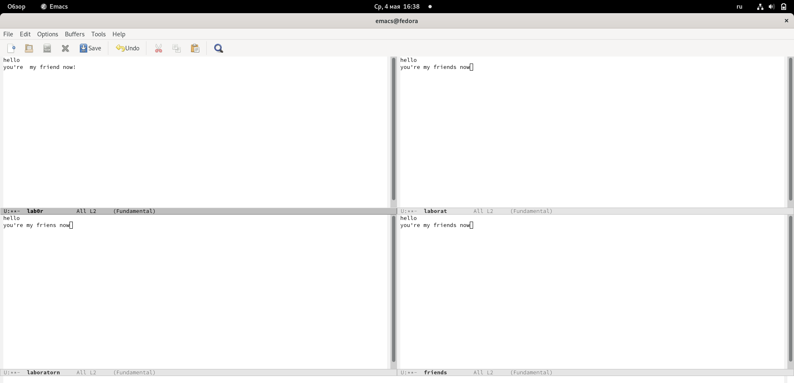

##

9.4. Перешел в режим поиска и замены (M-%), ввел текст, который следует найти и заменить, нажал Enter , затем ввел текст для замены. После того как были подсвечены результаты поиска, нажал ! для подтверждения замены.

Cкрин со старого устройства

##

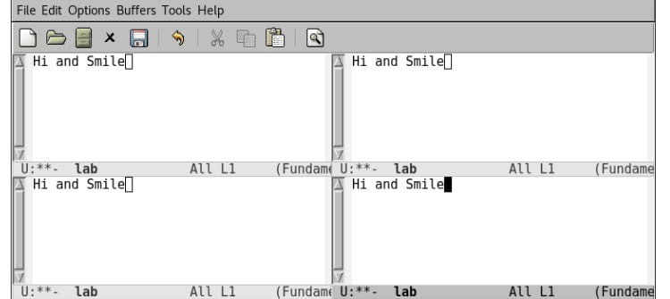

##

9.5. Испробовал другой режим поиска, нажав M-s o. Он отличается от обычного режима тем, что при поиске указывает номера строк в которых найдено введённое слово и выделяет их цветом. В обычном режиме выделение цветом появляется, только когда нужно подтвердить замену.

##

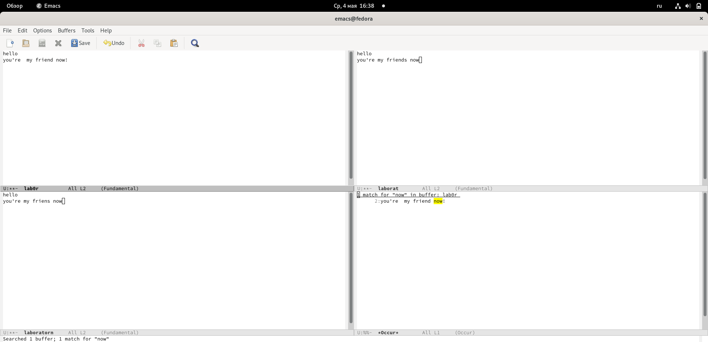

## Вывод

Познакомился с операционной системой Linux, получил практические навыки работы с редактором Emacs.

