---
## Front matter
title: "Лабораторная работа-13"
subtitle: "Средства, применяемые при разработке программного обеспечения в ОС типа UNIX/Linux"
author: "Бровкин Александр НБИбд-01-21"

## Generic otions
lang: ru-RU
toc-title: "Содержание"

## Bibliography
bibliography: bib/cite.bib
csl: pandoc/csl/gost-r-7-0-5-2008-numeric.csl

## Pdf output format
toc: true # Table of contents
toc-depth: 2
lof: true # List of figures
lot: true # List of tables
fontsize: 12pt
linestretch: 1.5
papersize: a4
documentclass: scrreprt
## I18n polyglossia
polyglossia-lang:
  name: russian
  options:
	- spelling=modern
	- babelshorthands=true
polyglossia-otherlangs:
  name: english
## I18n babel
babel-lang: russian
babel-otherlangs: english
## Fonts
mainfont: PT Serif
romanfont: PT Serif
sansfont: PT Sans
monofont: PT Mono
mainfontoptions: Ligatures=TeX
romanfontoptions: Ligatures=TeX
sansfontoptions: Ligatures=TeX,Scale=MatchLowercase
monofontoptions: Scale=MatchLowercase,Scale=0.9
## Biblatex
biblatex: true
biblio-style: "gost-numeric"
biblatexoptions:
  - parentracker=true
  - backend=biber
  - hyperref=auto
  - language=auto
  - autolang=other*
  - citestyle=gost-numeric
## Pandoc-crossref LaTeX customization
figureTitle: "Рис."
tableTitle: "Таблица"
listingTitle: "Листинг"
lofTitle: "Список иллюстраций"
lotTitle: "Список таблиц"
lolTitle: "Листинги"
## Misc options
indent: true
header-includes:
  - \usepackage{indentfirst}
  - \usepackage{float} # keep figures where there are in the text
  - \floatplacement{figure}{H} # keep figures where there are in the text
---

# Цель работы

Приобрести простейшие навыки разработки,анализа,тестирования и отладки приложений в ОС типа UNIX/Linux на примере создания на языке программирования
С калькулятора с простейшими функциями.

# Задание

1. В домашнем каталоге создайте подкаталог ~/work/os/lab_prog.

2. Создайте в нём файлы: calculate.h,calculate.c,main.c.
Это будетпримитивнейший калькулятор,способный складывать,вычитать,умножать
и делить,возводить число в степень,брать квадратный корень,вычислять sin,cos,tan.
При запуске он будетзапрашиватьпервое число,операцию,второе число.После этого
программа выведет результати остановится.
Реализация функций калькулятора в файле calculate.h:

Интерфейсный файл calculate.h, описывающий формат вызова функции-
калькулятора:

3. Выполните компиляцию программы посредством gcc:

4. При необходимости исправьте синтаксические ошибки.

5. Создайте Makefile со следующим содержанием:
Поясните в отчёте его содержание.

6. С помощью gdb выполните отладку программы calcul (перед использованием gdb
исправьте Makefile):
– Запустите отладчик GDB,загрузив в него программу для отладки:
Кулябов Д.С.и др. Операционные системы 109
1 gdb ./calcul
– Для запуска программы внутри отладчика введите команду run:
1 run
– Для постраничного (по 9 строк) просмотра исходного код используйте команду
list:
1 list
– Дляпросмотрастрокс12по15основногофайлаиспользуйтеlist спараметрами:
1 list 12,15
– Для просмотра определённых строк не основного файла используйте list с па-
раметрами:
1 list calculate.c:20,29
– Установитеточку останова в файле calculate.c на строке номер 21:
1 list calculate.c:20,27
2 break 21
– Выведите информацию об имеющихся в проектеточка останова:
1 info breakpoints
– Запустите программу внутри отладчика и убедитесь,что программа остановится
в момент прохожденияточки останова:
1 run
2 5
3 -
4 backtrace
– Отладчик выдастследующую информацию:
1 #0 Calculate (Numeral=5, Operation=0x7fffffffd280 "-")
2 at calculate.c:21
3 #1 0x0000000000400b2b in main () at main.c:17
акомандаbacktrace покажетвесьстеквызываемыхфункцийотначалапрограм-
мы дотекущего места.
– Посмотрите,чему равно на этом этапе значение переменной Numeral,введя:
110 Лабораторная работа No 13. Средства,применяемые при разработке программного...
1 print Numeral
На экран должно быть выведено число 5.
– Сравните с результатом вывода на экран после использования команды:
1 display Numeral
– Уберитеточки останова:
1 info breakpoints
2 delete 1

7. С помощью утилиты splint попробуйте проанализировать коды файлов calculate.c
и main.c.

# Выполнение лабораторной работы

1. В домашнем каталоге создал подкаталог ~/work/os/lab_prog.(рис. [-@fig:001])

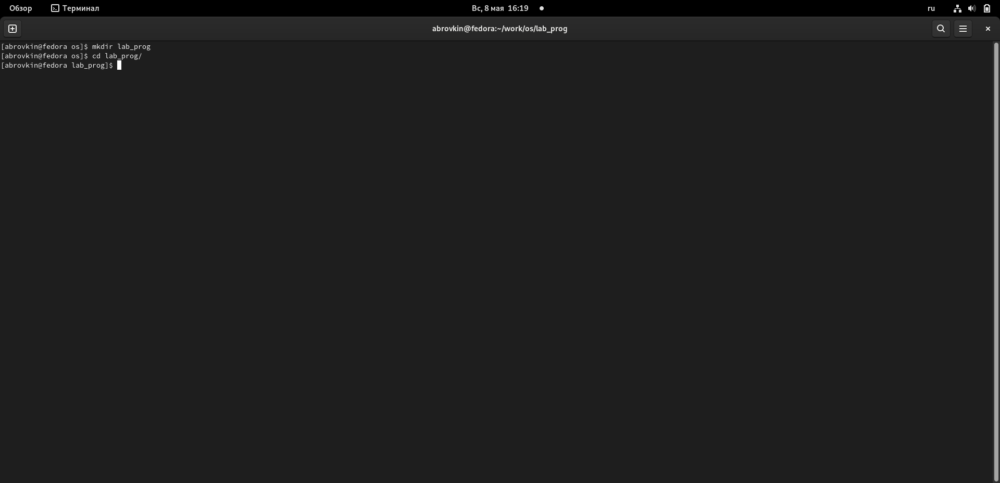{ #fig:001 width=70% }

2. Создал в нём файлы: calculate.h, calculate.c, main.c. Это примитивнейший калькулятор, способный складывать, вычитать, умножать, делить, возводить число в степень, вычислять квадратный корень, вычислять sin, cos, tan. При запуске он запрашивает первое число, операцию, второе число. После этого программа выводит результат и останавливается.(рис. [-@fig:002])

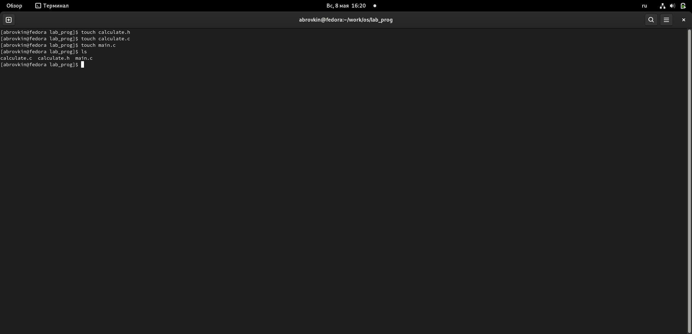{ #fig:002 width=70% }

Реализация функций калькулятора в файле calculate.c:(рис. [-@fig:003])(рис. [-@fig:004])

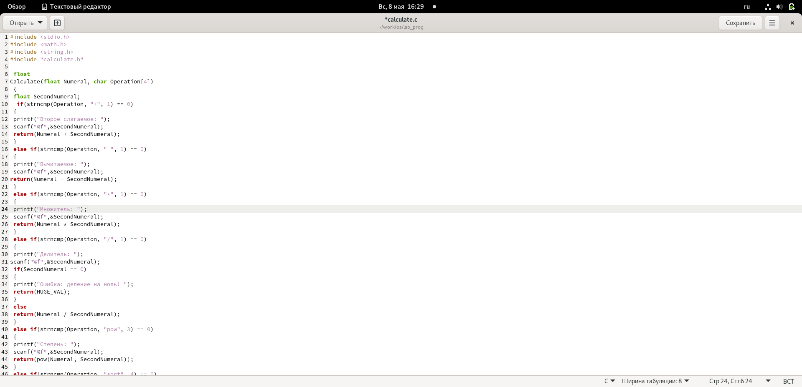{ #fig:003 width=70% }

{ #fig:004 width=70% }

Интерфейсный файл calculate.h, описывающий формат вызова функции калькулятора:(рис. [-@fig:005])

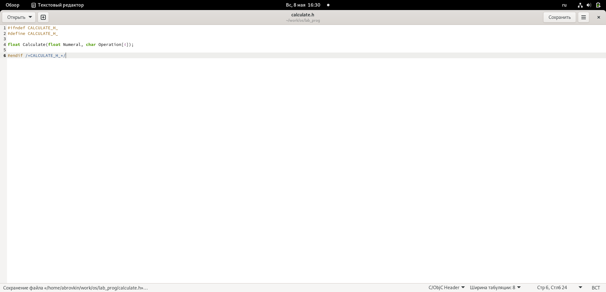{ #fig:005 width=70% }

Основной файл main.c, реализующий интерфейс пользователя к калькулятору:(рис. [-@fig:006])

{ #fig:006 width=70% }

3.Выполнил компиляцию программы посредством gcc:(рис. [-@fig:007])(рис. [-@fig:008])

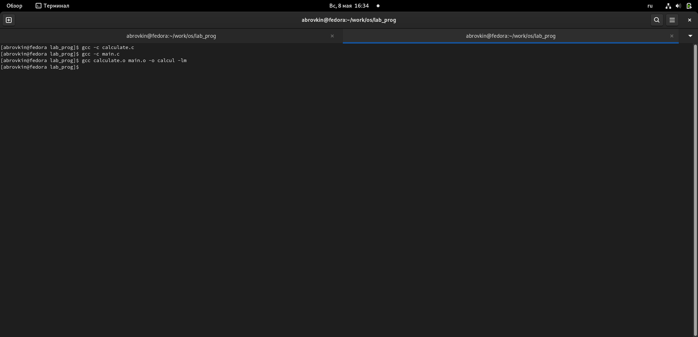{ #fig:007 width=70% }

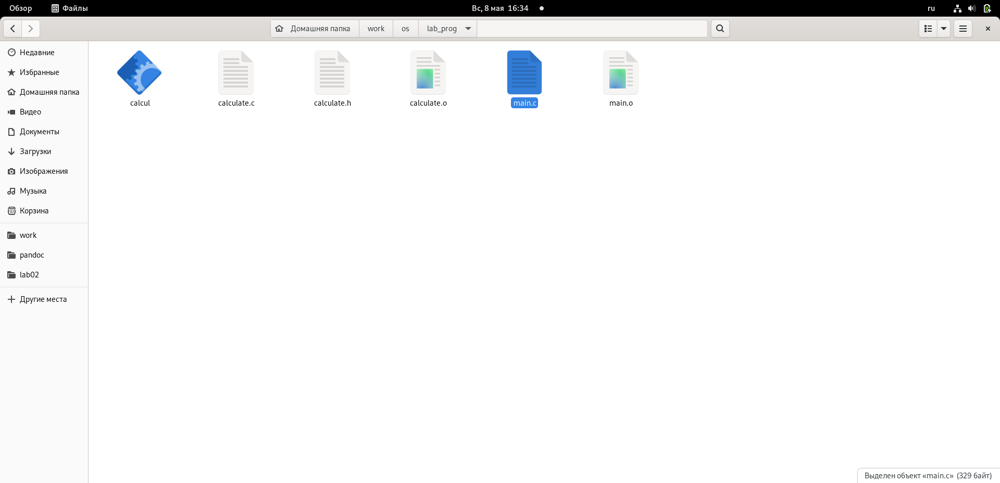{ #fig:008 width=70% }

4. Исправил синтаксические ошибки.
5. Создал Makefile.(рис. [-@fig:009])

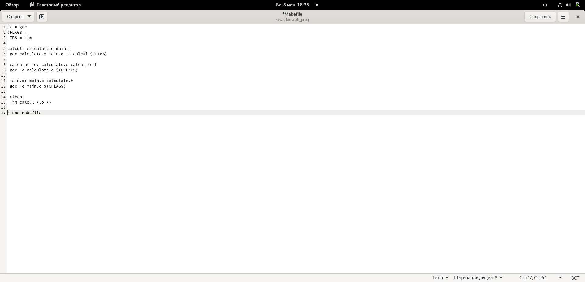{ #fig:009 width=70% }

В содержании файла указаны флаги компиляции, тип компилятора и файлы, которые должен собрать сборщик.

6. С помощью gdb выполнил отладку программы calcul (перед использованием gdb исправил Makefile):
– запустите отладчик GDB, загрузив в него программу для отладки: gdb ./calcul
– для запуска программы внутри отладчика ввел команду run(рис. [-@fig:010])(рис. [-@fig:011])

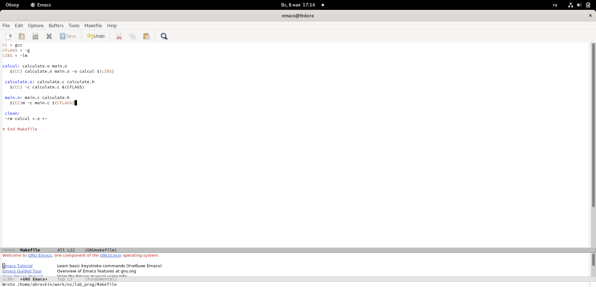{ #fig:010 width=70% }

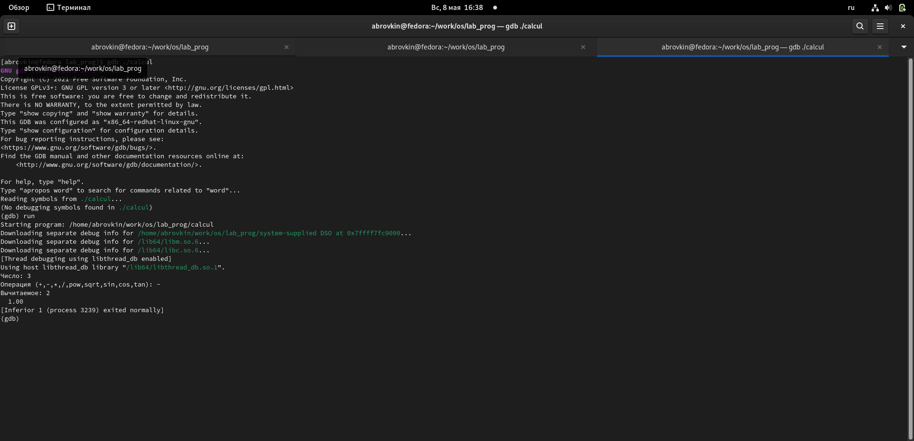{ #fig:011 width=70% }

– для постраничного (по 9 строк) просмотра исходного код использовал команду list
– для просмотра строк с 12 по 15 основного файла использовал list с параметрами:
list 12,15(рис. [-@fig:012])(рис. [-@fig:013])

{ #fig:012 width=70% }

{ #fig:013 width=70% }

– для просмотра определённых строк не основного файла использовал list с параметрами: list calculate.c:20,29
– установил точку останова в файле calculate.c на строке номер 21: 
list calculate.c:20,27
break 20
– вывел информацию об имеющихся в проекте точка останова: info breakpoints(рис. [-@fig:014])(рис. [-@fig:015])

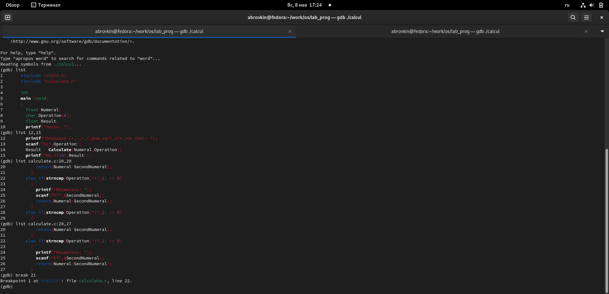{ #fig:014 width=70% }

{ #fig:015 width=70% }

– запустил программу внутри отладчика и убедился, что программа остановится в момент прохождения точки останова
– отладчик выдал следующую информацию, а команда backtrace показала весь стек вызываемых функций от начала программы до текущего места:
– посмотрел, чему равно на этом этапе значение переменной Numeral, введя:
print Numeral
– сравнил с результатом вывода на экран после использования команды:
display Numeral
– убрал точки останова:
info breakpoints
delete 1(рис. [-@fig:016])(рис. [-@fig:017])(рис. [-@fig:018])

{ #fig:016 width=70% }

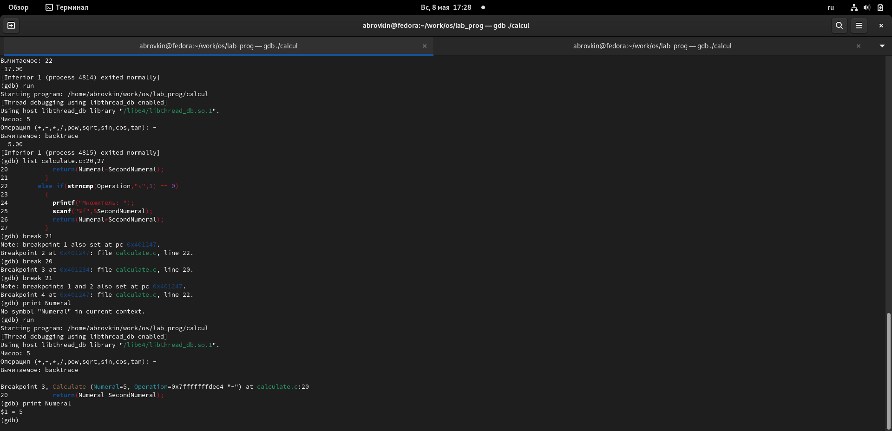{ #fig:017 width=70% }

{ #fig:018 width=70% }

7. С помощью утилиты splint попробуйте проанализировать коды файлов
calculate.c и main.c.(рис. [-@fig:019])(рис. [-@fig:020])

{ #fig:019 width=70% }

{ #fig:020 width=70% }

# Вывод:

Приобрел простейшие навыки разработки, анализа, тестирования и отладки приложений в ОС типа UNIX/Linux на примере создания на языке программирования C калькулятора с простейшими функциями.

# Ответы на контрольные вопросы:
1. Информацию об этих программах можно получить с помощью функций info и man.

2. Unix поддерживает следующие основные этапы разработки приложений:
-создание исходного кода программы; - представляется в виде файла
-сохранение различных вариантов исходного текста;
-анализ исходного текста; необходимо отслеживать изменения исходного кода, а также при работе более двух программистов над проектом программы нужно, чтобы они не делали изменений кода в одно время.
-компиляция исходного текста и построение исполняемого модуля;
-тестирование и отладка; - проверка кода на наличие ошибок
-сохранение всех изменений, выполняемых при тестировании и отладке.

3. Использование суффикса ".с" для имени файла с программой на языке Си отражает удобное и полезное соглашение, принятое в ОС UNIX. Для любого имени входного файла суффикс определяет какая компиляция требуется. Суффиксы и префиксы указывают тип объекта. Одно из полезных свойств компилятора Си — его способность по суффиксам определять типы файлов. По суффиксу .c компилятор распознает, что файл abcd.c должен компилироваться, а по суффиксу .o, что файл abcd.о является объектным модулем и для получения исполняемой программы необходимо выполнить редактирование связей. Простейший пример командной строки для компиляции программы abcd.c и построения исполняемого модуля abcd имеет вид: gcc -o abcd abcd.c. Некоторые проекты предпочитают показывать префиксы в начале текста изменений для старых (old) и новых (new) файлов. Опция – prefix может быть использована для установки такого префикса. Плюс к этому команда bzr diff -p1 выводит префиксы в форме которая подходит для команды patch -p1.

4. Основное назначение компилятора с языка Си заключается в компиляции всей программы в целом и получении исполняемого модуля.

5. При разработке большой программы, состоящей из нескольких исходных файлов заголовков, приходится постоянно следить за файлами, которые требуют перекомпиляции после внесения изменений. Программа make освобождает пользователя от такой рутинной работы и служит для документирования взаимосвязей между файлами. Описание взаимосвязей и соответствующих действий хранится в так называемом make-файле, который по умолчанию имеет имя makefile или Makefile.

6. В общем случае make-файл содержит последовательность записей (строк), определяющих зависимости между файлами. Первая строка записи представляет собой список целевых (зависимых) файлов, разделенных пробелами, за которыми следует двоеточие и список файлов, от которых зависят целевые. Текст, следующий за точкой с запятой, и все последующие строки, начинающиеся с литеры табуляции, являются командами OC UNIX, которые необходимо выполнить для обновления целевого файла. Таким образом, спецификация взаимосвязей имеет формат: target1 [ target2...]: [:] [dependment1...] [(tab)commands] [#commentary] [(tab)commands] [#commentary], где # — специфицирует начало комментария, так как содержимое строки, начиная с # и до конца строки, не будет обрабатываться командой make; : — последовательность команд ОС UNIX должна содержаться в одной строке make-файла (файла описаний), есть возможность переноса команд (\), но она считается как одна строка; :: — последовательность команд ОС UNIX может содержаться в нескольких последовательных строках файла описаний. Приведённый выше make-файл для программы abcd.c включает два способа компиляции и построения исполняемого модуля. Первый способ предусматривает обычную компиляцию с построением исполняемого модуля с именем abcd. Второй способ позволяет включать в исполняемый модуль testabcd возможность выполнить процесс отладки на уровне исходного текста. Пример можно найти в задании 5.

7. Пошаговая отладка программ заключается в том, что выполняется один оператор программы и, затем контролируются те переменные, на которые должен был воздействовать данный оператор. Если в программе имеются уже отлаженные подпрограммы, то подпрограмму можно рассматривать, как один оператор программы и воспользоваться вторым способом отладки программ. Если в программе существует достаточно большой участок программы, уже отлаженный ранее, то его можно выполнить, не контролируя переменные, на которые он воздействует. Использование точек останова позволяет пропускать уже отлаженную часть программы. Точка останова устанавливается в местах, где необходимо проверить содержимое переменных или просто проконтролировать, передаётся ли управление данному оператору. Практически во всех отладчиках поддерживается это свойство (а также выполнение программы до курсора и выход из подпрограммы). Затем отладка программы продолжается в пошаговом режиме с контролем локальных и глобальных переменных, а также внутренних регистров микроконтроллера и напряжений на выводах этой микросхемы.

8. backtrace - вывод на экран пути к текущей точке останова (по сути
вывод названий всех функций)
break - установить точку останова (в качестве параметра может
быть указан номер строки или название функции)
clear - удалить все точки останова в функции
continue - продолжить выполнение программы
delete - удалить точку останова
display - добавить выражение в список выражений, значения которых отображаются при достижении точки останова программы
finish - выполнить программу до момента выхода из функции
info breakpoints - вывести на экран список используемых точек останова
info watchpoints - вывести на экран список используемых контрольных выражений
list - вывести на экран исходный код (в качестве параметра может быть указано название файла и через двоеточие номера начальной и конечной строк)
next - выполнить программу пошагово, но без выполнения вызываемых в программе функций
print - вывести значение указываемого в качестве параметра выражения
run - запуск программы на выполнение
set - установить новое значение переменной
step - пошаговое выполнение программы
watch - установить контрольное выражение, при изменении значения которого программа будет остановлена

9. 1) Выполнила компиляцию программы 2)Увидела ошибки в программе 3) Открыла редактор и исправила программу 4) Загрузила программу в отладчик gdb 5) run — отладчик выполнил программу, ввела требуемые значения. 6) Использовала другие команды отладчика и проверила работу программы

10. Отладчику не понравился формат %s для &Operation, т.к %s — символьный формат, а значит необходим только Operation.

11. Если вы работаете с исходным кодом, который не вами разрабатывался, то назначение различных конструкций может быть не совсем понятным. Система разработки приложений UNIX предоставляет различные средства, повышающие понимание исходного кода. К ним относятся:
– cscope - исследование функций, содержащихся в программе;
– splint — критическая проверка программ, написанных на языке Си.

12. 1. Проверка корректности задания аргументов всех использованных в программе функций, а также типов возвращаемых ими значений;
2.Поиск фрагментов исходного текста, корректных с точки зрения синтаксиса языка Си, но малоэффективных с точки зрения их реализации или содержащих в себе семантические ошибки;
3.Общая оценка мобильности пользовательской программы.

