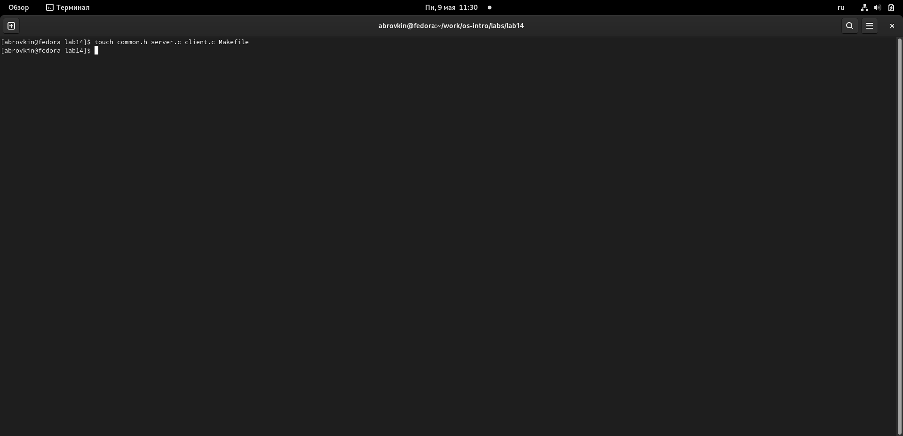
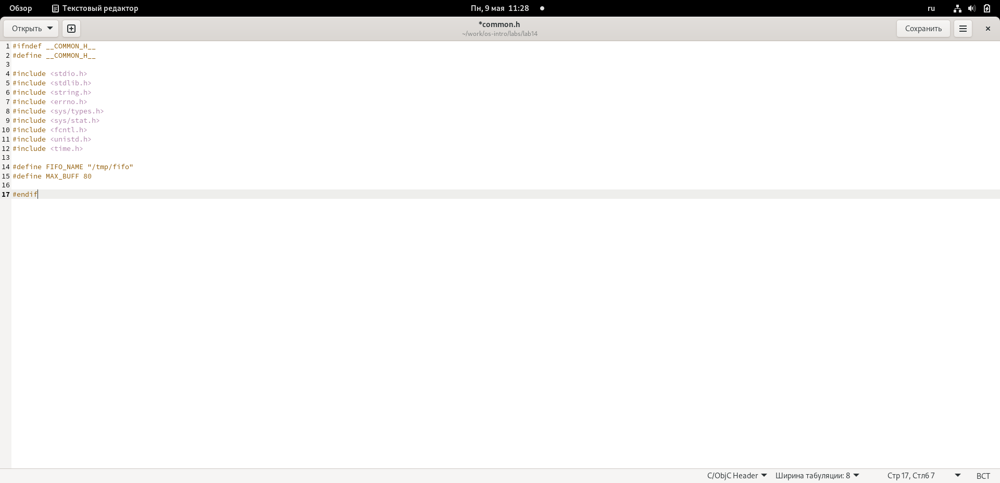
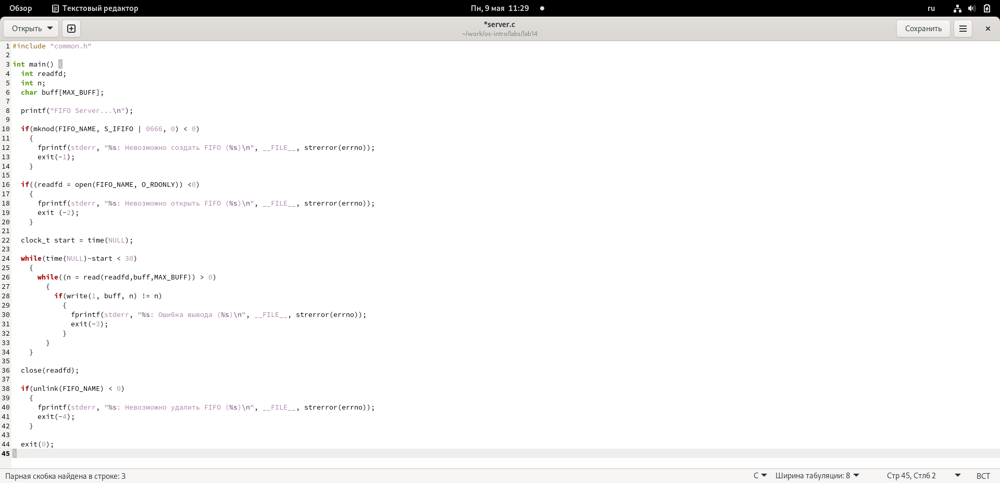
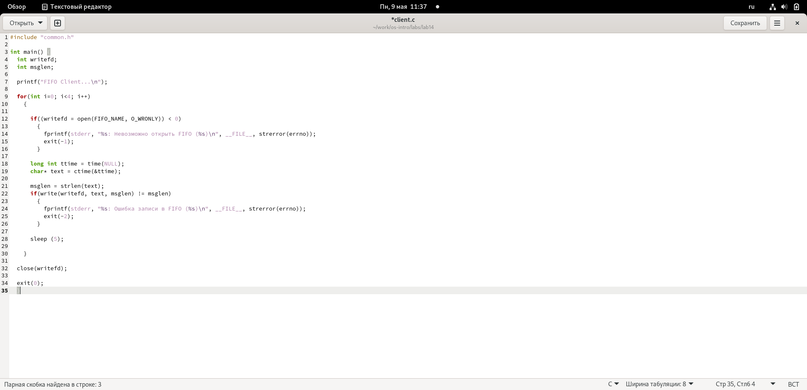
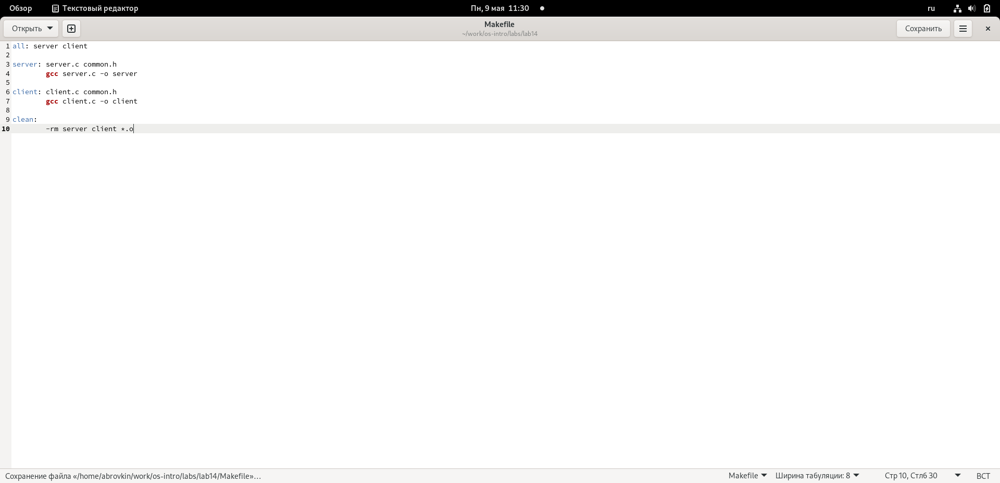
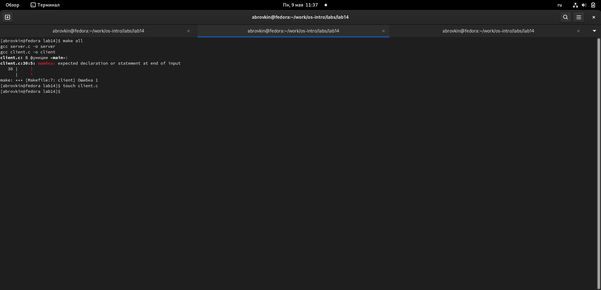
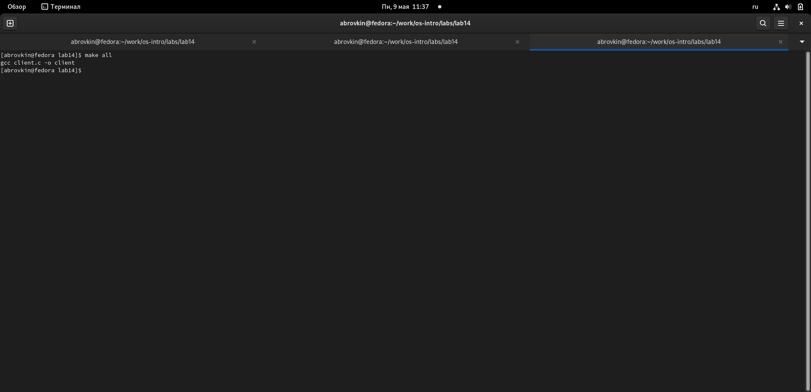
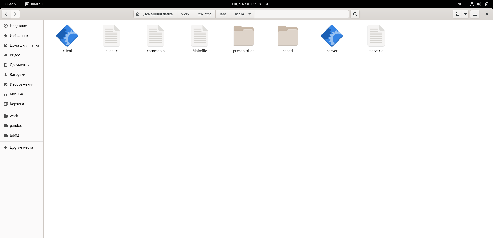
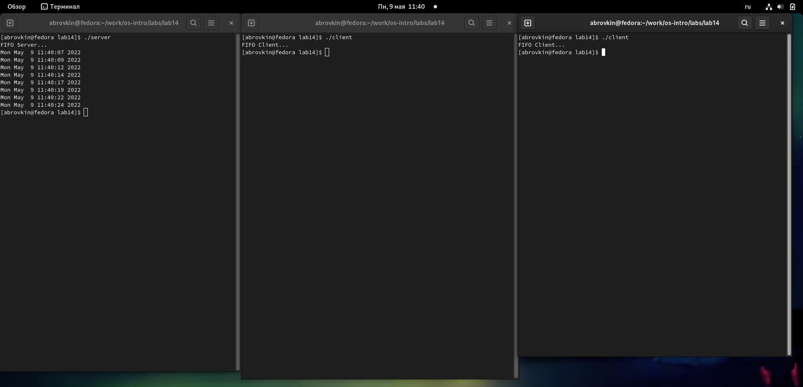

---
## Front matter
lang: ru-RU
title: Именованные каналы
author: |
	  Бровкин Александр НБИбд-01-21\inst{1}

institute: |
	\inst{1}Российский Университет Дружбы Народов

date: 9 мая, 2022, Москва, Россия

## Formatting
mainfont: PT Serif
romanfont: PT Serif
sansfont: PT Sans
monofont: PT Mono
toc: false
slide_level: 2
theme: metropolis
header-includes: 
 - \metroset{progressbar=frametitle,sectionpage=progressbar,numbering=fraction}
 - '\makeatletter'
 - '\beamer@ignorenonframefalse'
 - '\makeatother'
aspectratio: 43
section-titles: true

---

## Цель работы

Приобретение практических навыков работы с именованными каналами.

## Ход работы

1. Для начала я создал необходимые файлы с помощью команды «touch common.h server.c client.c Makefile»  и открыл редактор emacs для их редактирования.

##

2. Далее я изменил коды программ, представленных в тексте лабораторной работы.
В файл common.h добавил стандартные заголовочные файлы unistd.h и time.h, необходимые для работы кодов других файлов. Common.h предназначен для заголовочных файлов, чтобы в остальных программах их не прописывать каждый раз

##

В файл server.c добавил цикл while для контроля за временем работы сервера. Разница между текущим временем time(NULL) и временем начала работы clock_t start=time(NULL) (инициализация до цикла) не должна превышать 30 секунд

##

В файл client.c добавил цикл, который отвечает за количество сообщений о текущем времени (4 сообщения), которое получается в результате выполнения команд, и команду sleep(5) для приостановки работы клиента на 5 секунд.

##

Makefile (файл для сборки) не изменял

##

3. После написания кодов, я, используя команду «make all», скомпилировал необходимые файлы

##

##

##
Далее я проверил работу написанного кода.
Отрыл 3 консоли (терминала) и запустил: в первом терминале − «./server», в остальных двух – «./client». В результате каждый терминал-клиент вывел по 4 сообщения. Спустя 30 секунд работа сервера была прекращена. Программа работает корректно.

##

##

Также я отдельно проверил длительность работы сервера, введя команду «./server» в одном терминале. Он завершил свою работу через 30 секунд.
Если сервер завершит свою работу, не закрыв канал, то, когда мы будем запускать этот сервер снова, появится ошибка «Невозможно создать FIFO», так как у нас уже есть один канал.

## Выводы

В ходе выполнения данной лабораторной работы я приобрёл практические навыки работы с именованными каналами.

