---
## Front matter
lang: ru-RU
title: Первый этап индивидуального проекта
author: |
	  Бровкин Александр НБИбд-01-21\inst{1}

institute: |
	\inst{1}Российский Университет Дружбы Народов

date: 29 апреля, 2022, Москва, Россия

## Formatting
mainfont: PT Serif
romanfont: PT Serif
sansfont: PT Sans
monofont: PT Mono
toc: false
slide_level: 2
theme: metropolis
header-includes: 
 - \metroset{progressbar=frametitle,sectionpage=progressbar,numbering=fraction}
 - '\makeatletter'
 - '\beamer@ignorenonframefalse'
 - '\makeatother'
aspectratio: 43
section-titles: true

---

## Цель работы

Загрузка шаблона сайта на репозиторий и гит и синхронизация сайта с гит.

## Задание

Размещение на Github pages заготовки для персонального сайта.

    Установить необходимое программное обеспечение.
    Скачать шаблон темы сайта.
    Разместить его на хостинге git.
    Установить параметр для URLs сайта.
    Разместить заготовку сайта на Github pages.

## Выполнение работы 
# Установил необходимое программное устройство

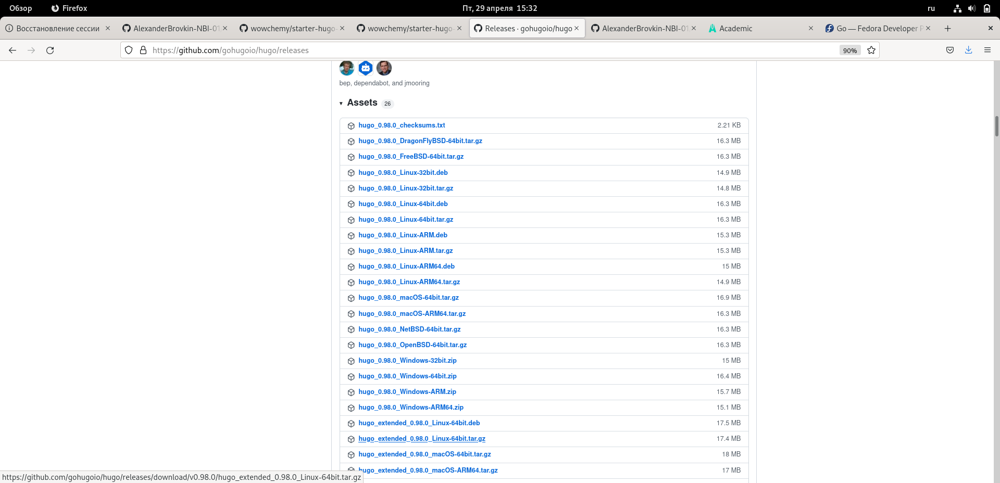

## Использую команду ~/bin/hugo, чтобы скопировать ссылку на сайт. Все получилось
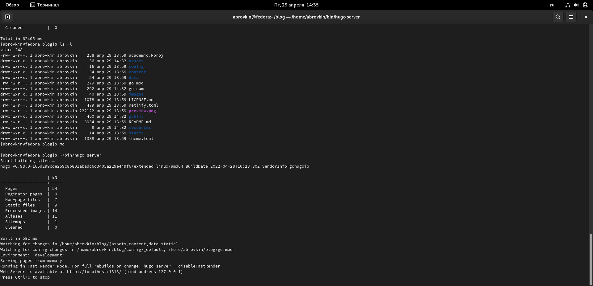

## Далее перехожу в гитхаб и создаю еще один репозиторий, у меня он уже создан
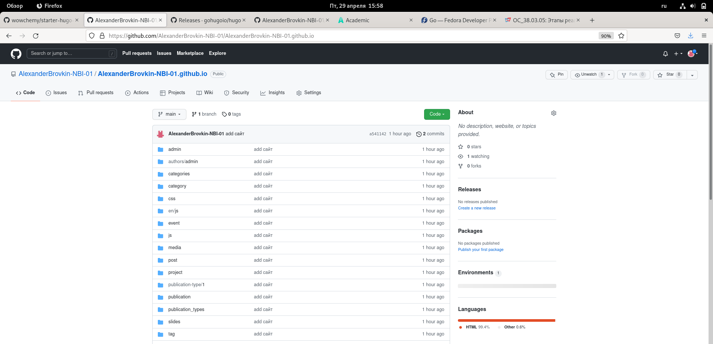

## Клонируем данный репозиторий
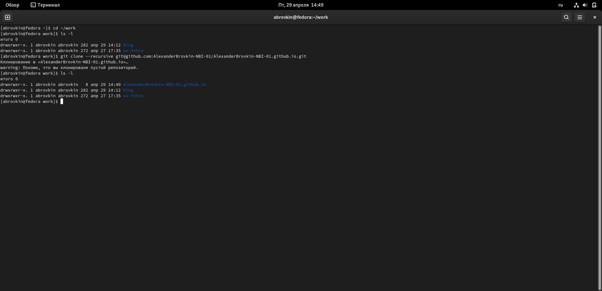

## Переключаюсь на новую ветку и ввожу команды get add, git commit -am, git push
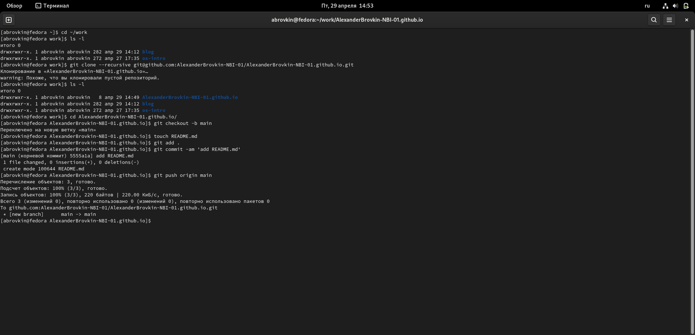
 
## Далее клонируем и в папке гитигнор комментируем public и теперь в нашей папке есть файл README.md
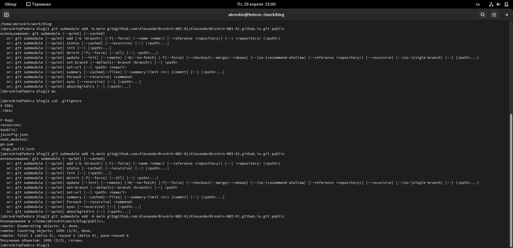

##

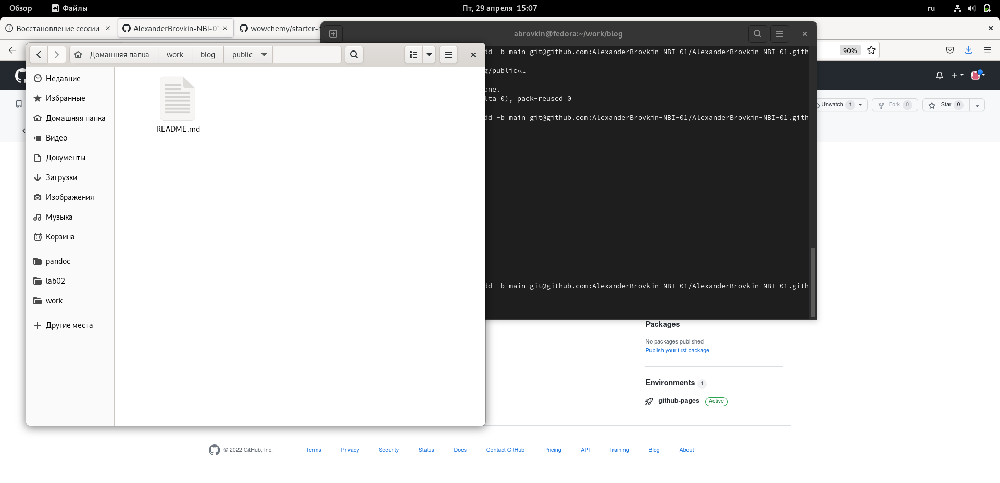

## Ввожу команду bin/hugo

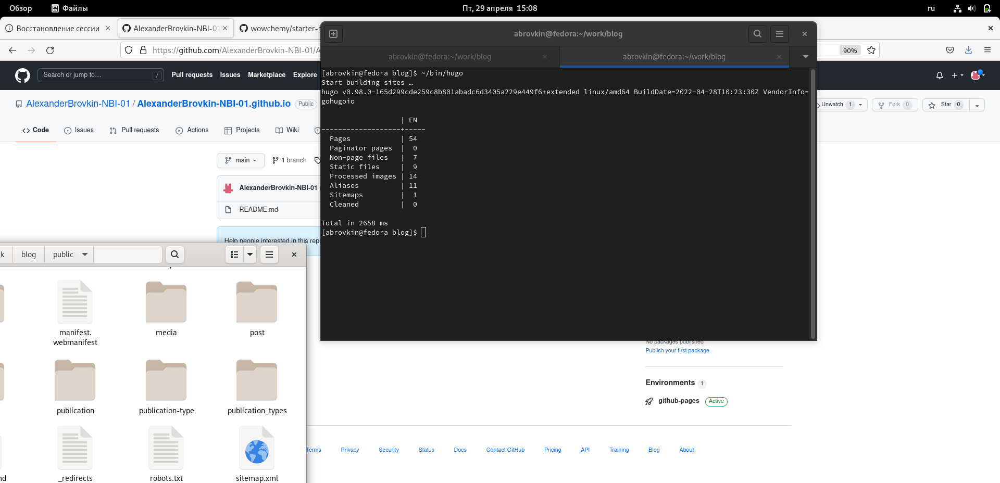

## Теперь этот каталог подключен к нашему репозиторию и проделываем стандартный действия
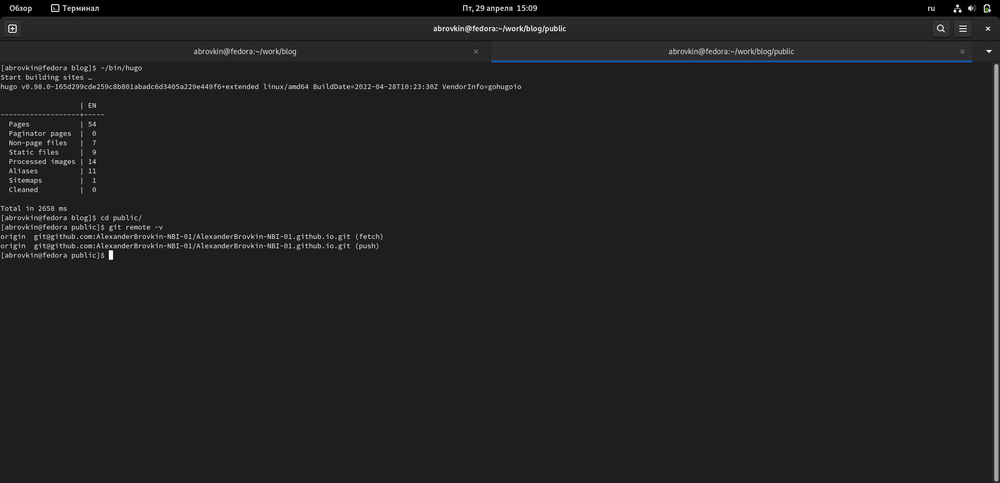

##

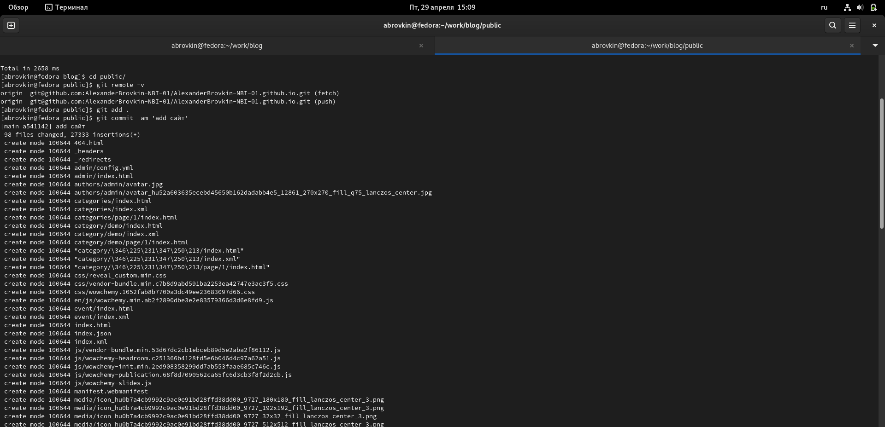

##

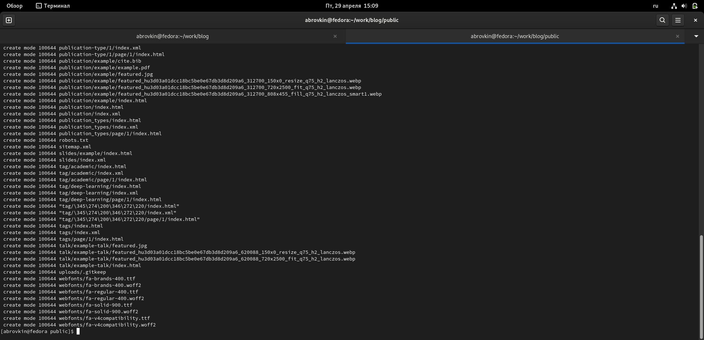

##

# А теперь копирую ссылку из своего гитхаба и вставляю в поисковик, все получилось
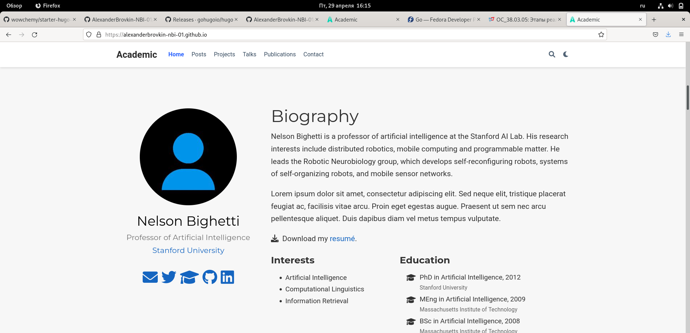{ #fig:001 width=70% }

## Выводы
Я научился работать и создавать сайты и синхронизировать его с гитхабом.

