---
## Front matter
lang: ru-RU
title: Третий этап индивидуального проекта
author: |
	  Бровкин Александр НБИбд-01-21\inst{1}

institute: |
	\inst{1}Российский Университет Дружбы Народов

date: 12 мая, 2022, Москва, Россия

## Formatting
mainfont: PT Serif
romanfont: PT Serif
sansfont: PT Sans
monofont: PT Mono
toc: false
slide_level: 2
theme: metropolis
header-includes: 
 - \metroset{progressbar=frametitle,sectionpage=progressbar,numbering=fraction}
 - '\makeatletter'
 - '\beamer@ignorenonframefalse'
 - '\makeatother'
aspectratio: 43
section-titles: true

---

## Цель работы

Научиться оформлять сайт.

## Задание

Добавить список достижений и сделать два новых поста.

## Выполнение лабораторной работы

Захожу в папку блог и ищу необходимые мне папки, а именно, навыки, опыт и достижения.

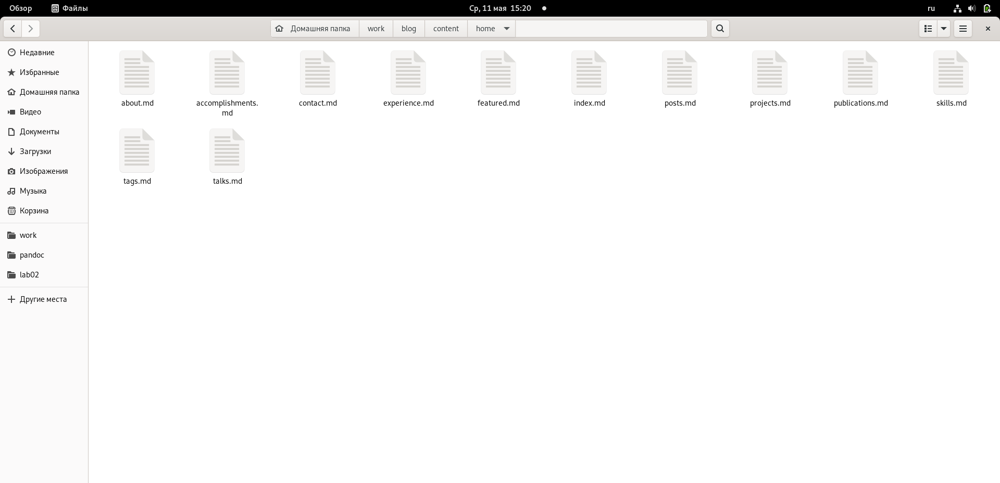

Сам сайт покажу в конце

##

Далее пишу свои навыки, меняю текст который там был изначально.
Также сразу изменяю опыт и достижения, добавляю информацию о себе.

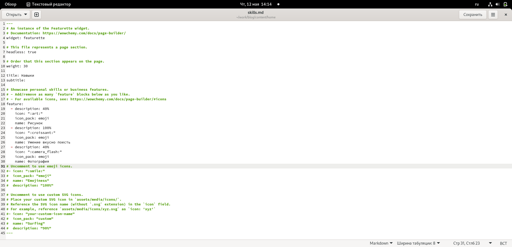

##

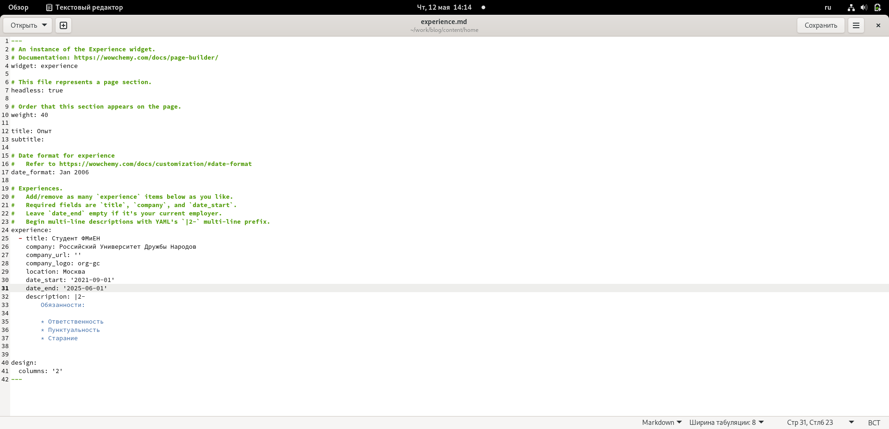

##

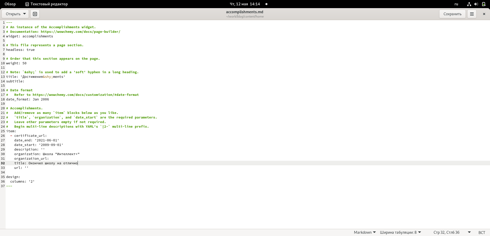

##

Далее нужно добавить пост по прошедшей неделе

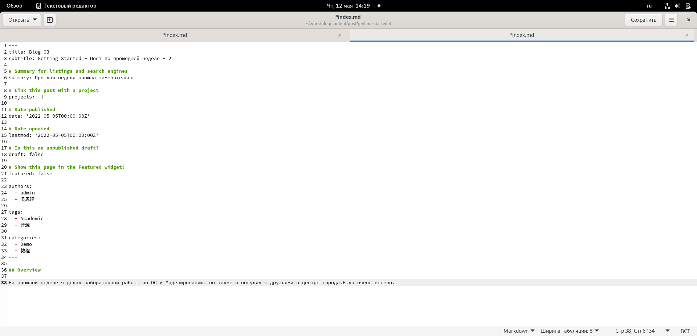

##

Также добавляю пост на тему Язык разметки Markdown

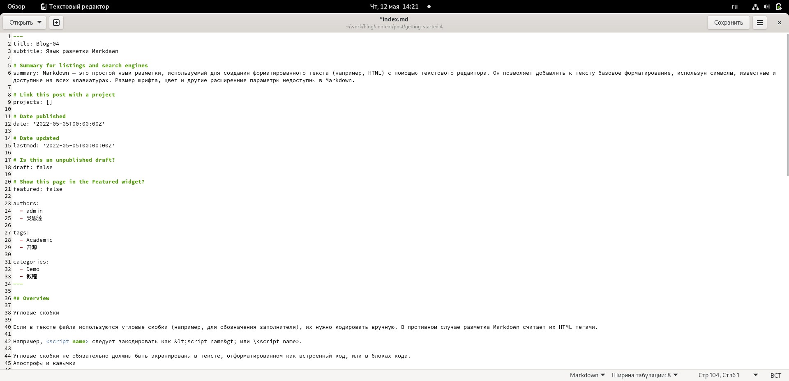

##

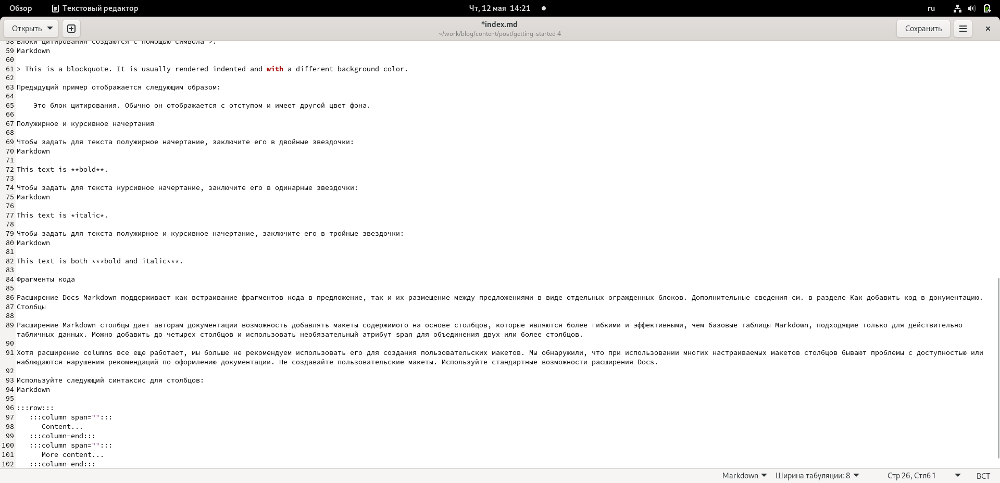

##

Загружаю все на сайт и вот итоговый результат:

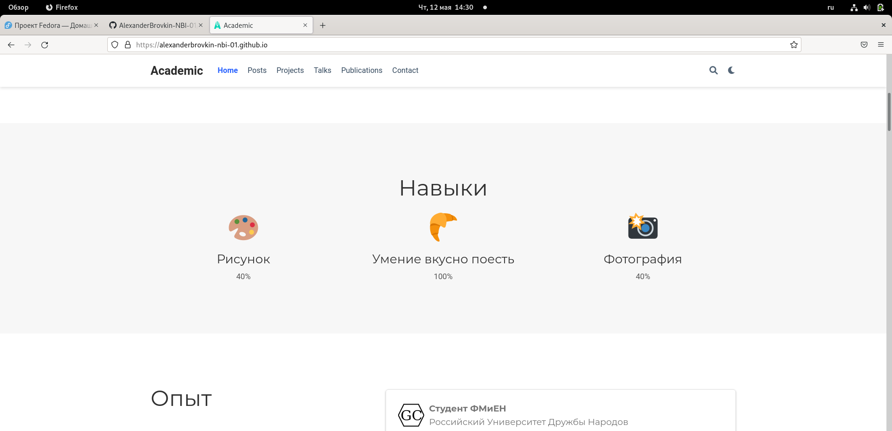

##

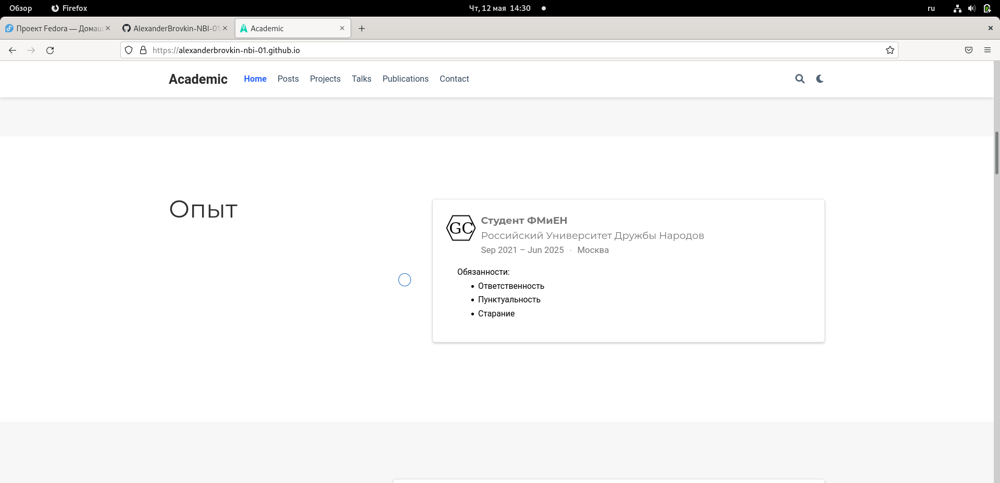

##

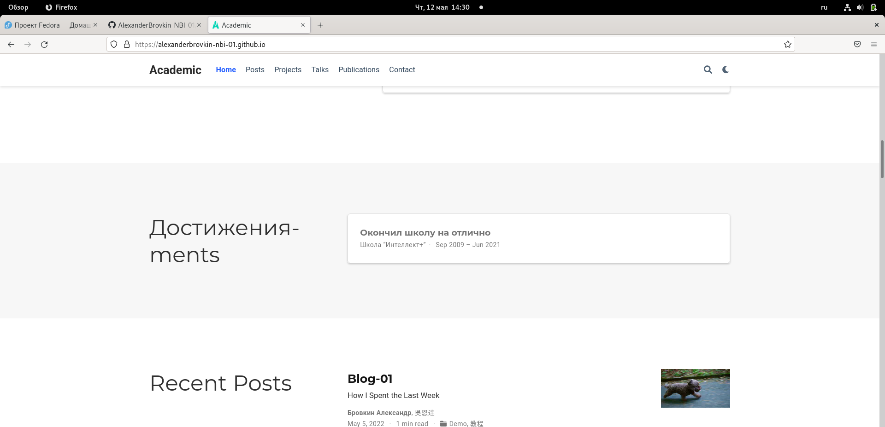

##

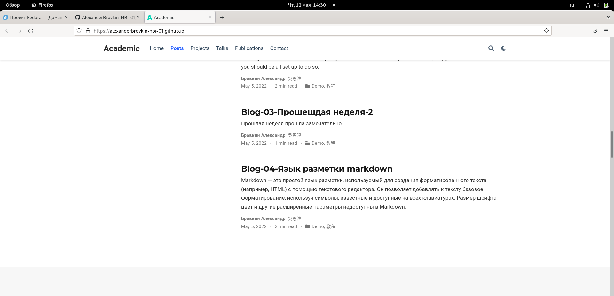

## Выводы

Я научился добавлять на сайт список своих навыков, мой имеющийся опыт и список достижений.

