---
## Front matter
title: "Индивидуальный проект-3 этап"
subtitle: "Добавление достижений"
author: "Бровкин Александр НБИбд-01-21"

## Generic otions
lang: ru-RU
toc-title: "Содержание"

## Bibliography
bibliography: bib/cite.bib
csl: pandoc/csl/gost-r-7-0-5-2008-numeric.csl

## Pdf output format
toc: true # Table of contents
toc-depth: 2
lof: true # List of figures
lot: true # List of tables
fontsize: 12pt
linestretch: 1.5
papersize: a4
documentclass: scrreprt
## I18n polyglossia
polyglossia-lang:
  name: russian
  options:
	- spelling=modern
	- babelshorthands=true
polyglossia-otherlangs:
  name: english
## I18n babel
babel-lang: russian
babel-otherlangs: english
## Fonts
mainfont: PT Serif
romanfont: PT Serif
sansfont: PT Sans
monofont: PT Mono
mainfontoptions: Ligatures=TeX
romanfontoptions: Ligatures=TeX
sansfontoptions: Ligatures=TeX,Scale=MatchLowercase
monofontoptions: Scale=MatchLowercase,Scale=0.9
## Biblatex
biblatex: true
biblio-style: "gost-numeric"
biblatexoptions:
  - parentracker=true
  - backend=biber
  - hyperref=auto
  - language=auto
  - autolang=other*
  - citestyle=gost-numeric
## Pandoc-crossref LaTeX customization
figureTitle: "Рис."
tableTitle: "Таблица"
listingTitle: "Листинг"
lofTitle: "Список иллюстраций"
lotTitle: "Список таблиц"
lolTitle: "Листинги"
## Misc options
indent: true
header-includes:
  - \usepackage{indentfirst}
  - \usepackage{float} # keep figures where there are in the text
  - \floatplacement{figure}{H} # keep figures where there are in the text
---

# Цель работы

Научиться оформлять сайт.

# Задание

Добавить список достижений и сделать два новых поста.

# Выполнение лабораторной работы

Захожу в папку блог и ищу необходимые мне папки, а именно, навыки, опыт и достижения. (рис. [-@fig:001])

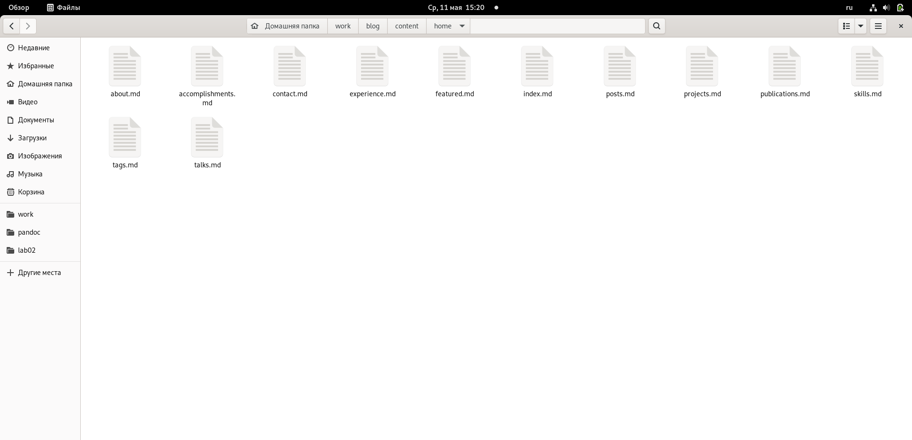{ #fig:001 width=70% }

Сам сайт покажу в конце

Далее пишу свои навыки, меняю текст который там был изначально.(рис. [-@fig:002])
Также сразу изменяю опыт и достижения, добавляю информацию о себе.(рис. [-@fig:003])(рис. [-@fig:004])

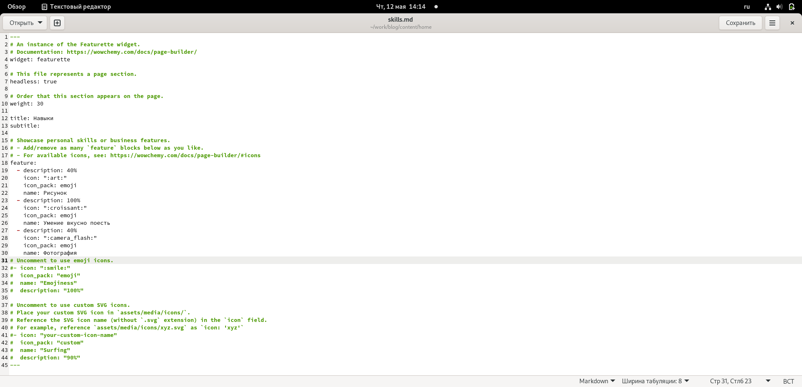{ #fig:002 width=70% }

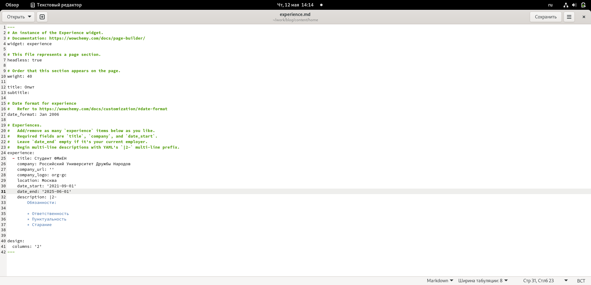{ #fig:003 width=70% }

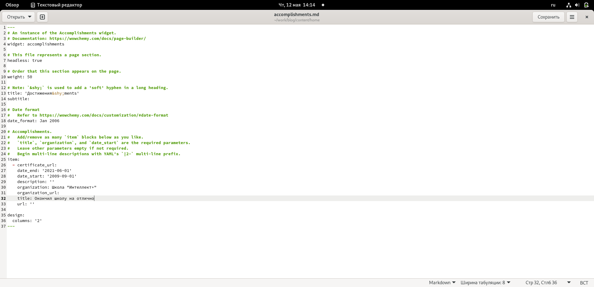{ #fig:004 width=70% }

Далее нужно добавить пост по прошедшей неделе(рис. [-@fig:005])

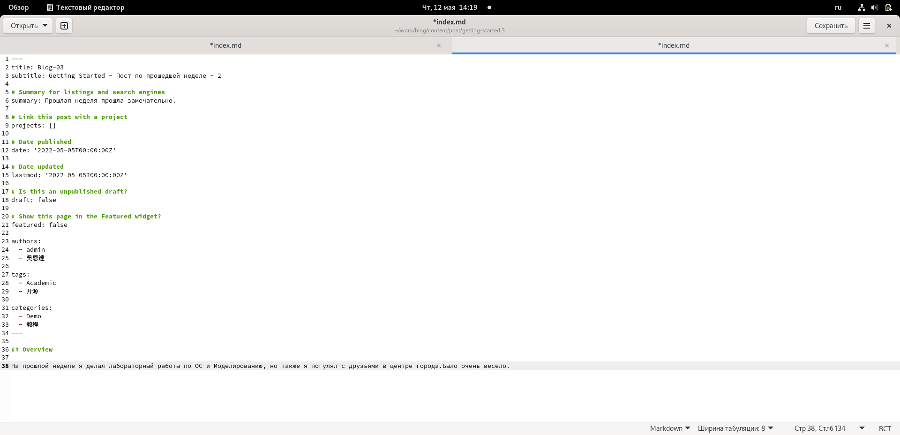{ #fig:005 width=70% }

Также добавляю пост на тему Язык разметки Markdown(рис. [-@fig:006])(рис. [-@fig:007])

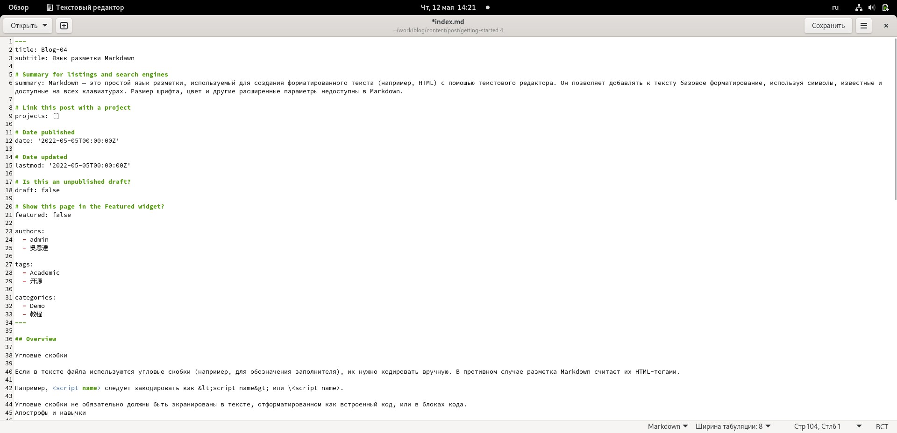{ #fig:006 width=70% }

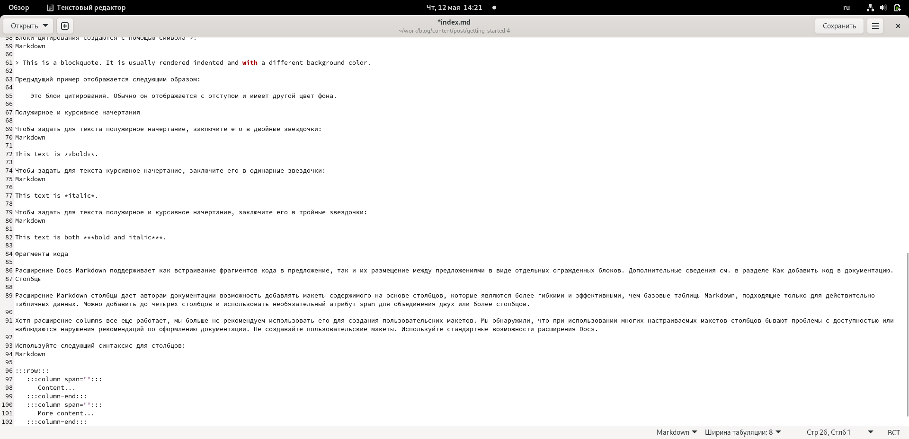{ #fig:007 width=70% }

Загружаю все на сайт и вот итоговый результат:(рис. [-@fig:008])(рис. [-@fig:009])(рис. [-@fig:010])(рис. [-@fig:011])

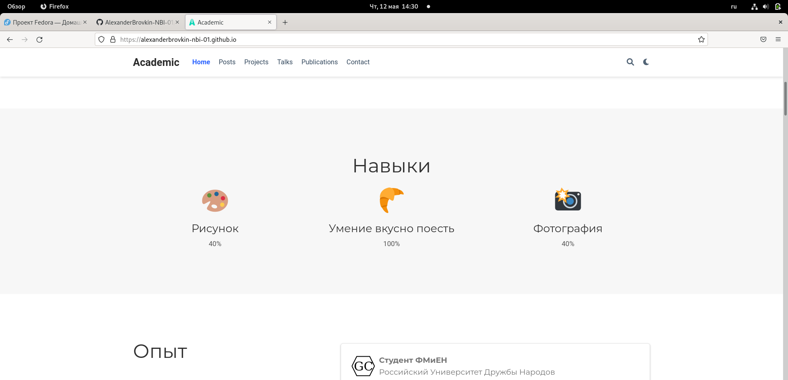{ #fig:008 width=70% }

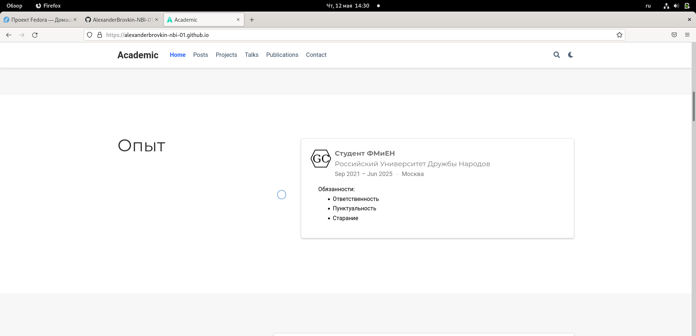{ #fig:009 width=70% }

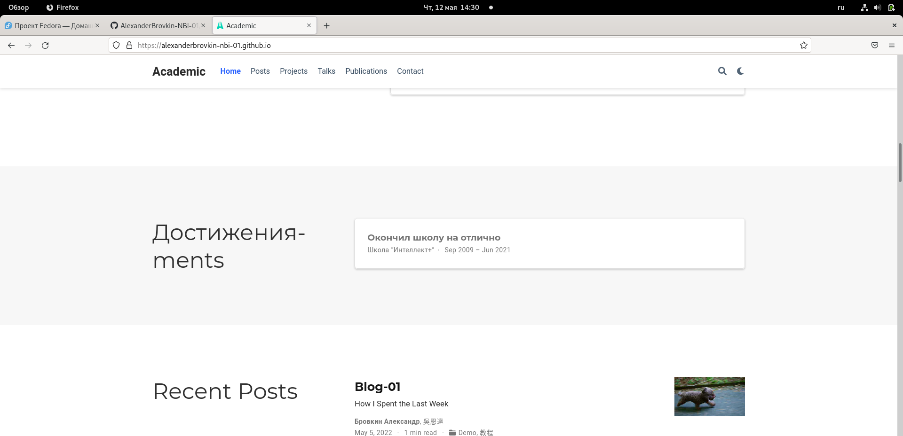{ #fig:010 width=70% }

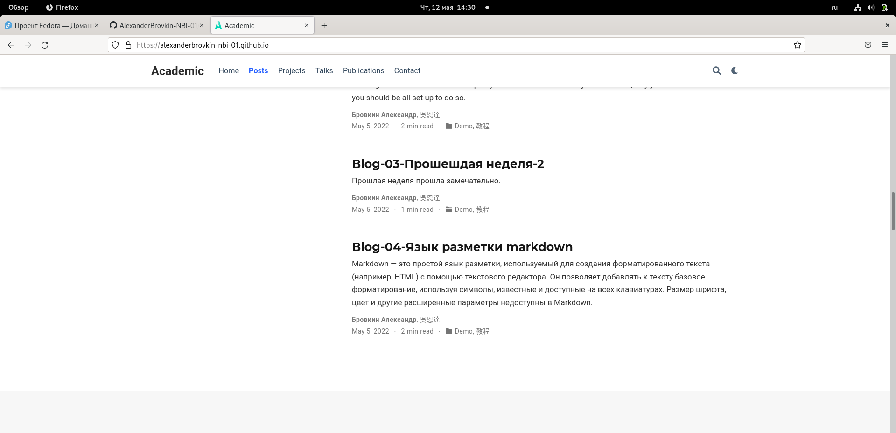{ #fig:011 width=70% }

# Выводы

Я научился добавлять на сайт список своих навыков, мой имеющийся опыт и список достижений.

