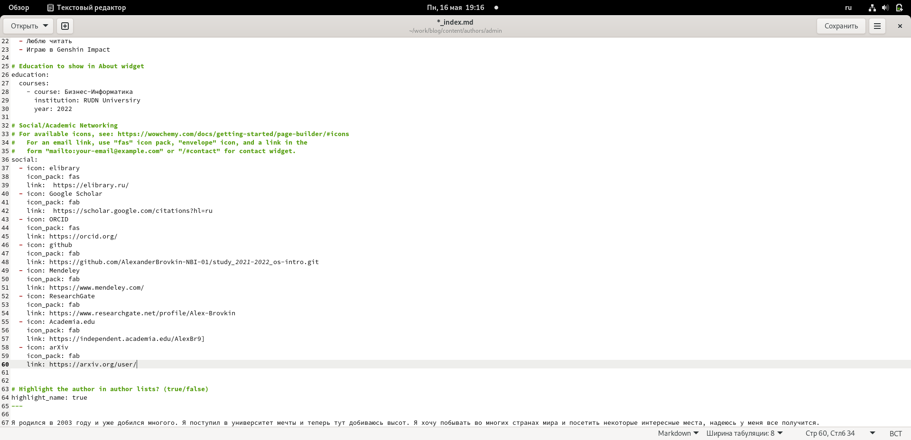
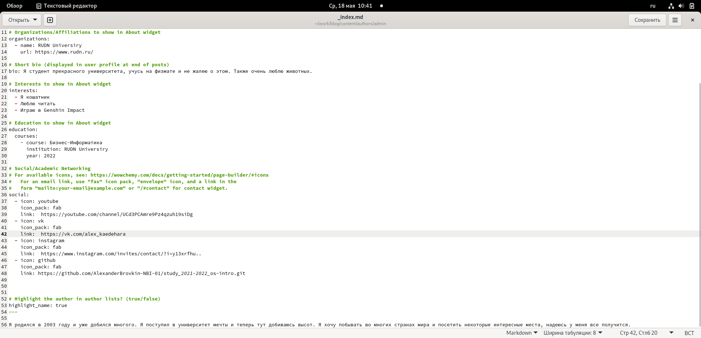
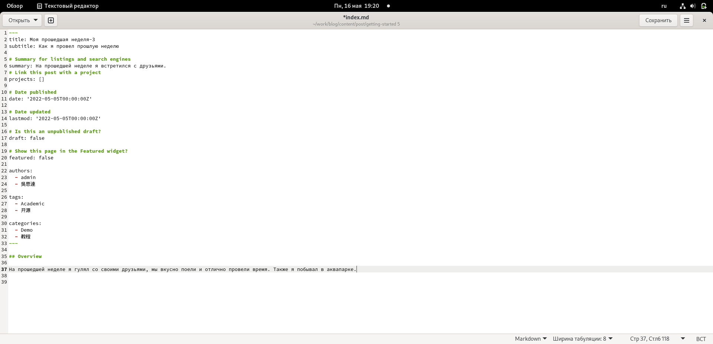
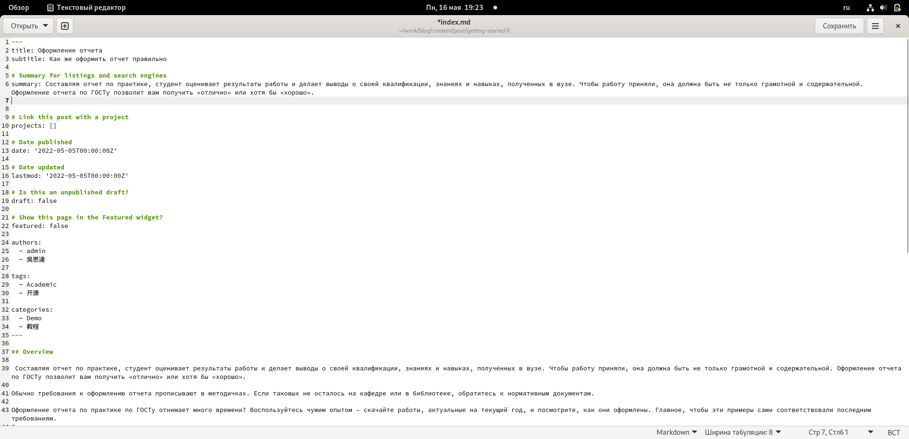
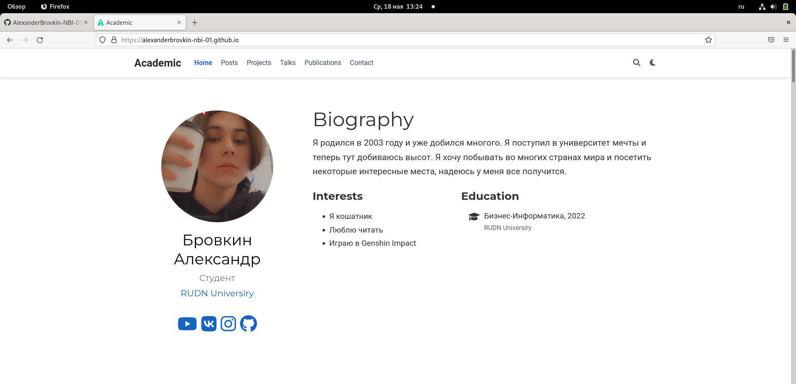
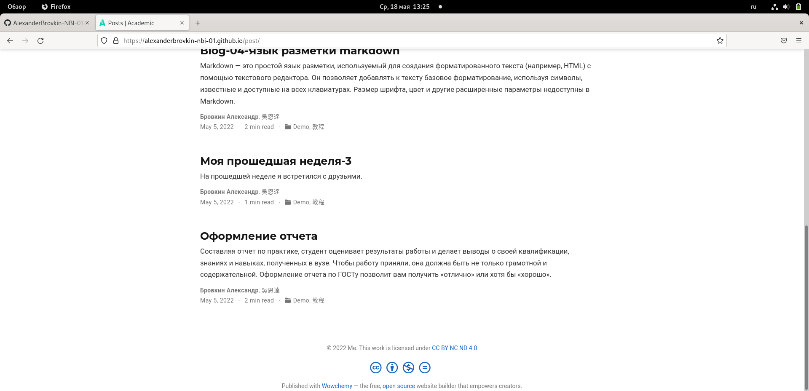

---
## Front matter
lang: ru-RU
title: Четвертый этап индивидуального проекта
author: |
	  Бровкин Александр НБИбд-01-21\inst{1}

institute: |
	\inst{1}Российский Университет Дружбы Народов

date: 18 мая, 2022, Москва, Россия

## Formatting
mainfont: PT Serif
romanfont: PT Serif
sansfont: PT Sans
monofont: PT Mono
toc: false
slide_level: 2
theme: metropolis
header-includes: 
 - \metroset{progressbar=frametitle,sectionpage=progressbar,numbering=fraction}
 - '\makeatletter'
 - '\beamer@ignorenonframefalse'
 - '\makeatother'
aspectratio: 43
section-titles: true

---

## Цель работы

Добавить на личный сайт ссылки на соц. сети и т.д.

## Выполнение лабораторной работы

Вставляю ссылки на соц. сети в которых зарегистрировался.

##

Так как не удалось зарег. в некоторых ресурсах, преподаватель разрешил просто добавить ссылки на свои соц. сети.

##

Далее пишу пост по прошедшей неделе

##

Также пишу пост по теме "Оформление отчета"

##

Вот итоговый вид моего сайта

##

## Выводы

Я загрузил ссылки и написал новые посты.
