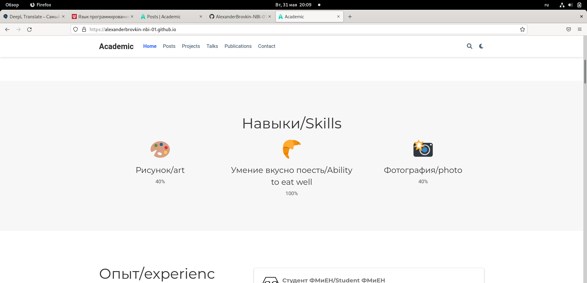

---
## Front matter
lang: ru-RU
title: Шестой этап индивидуального проекта
author: |
	  Бровкин Александр НБИбд-01-21\inst{1}

institute: |
	\inst{1}Российский Университет Дружбы Народов

date: 31 мая, 2022, Москва, Россия

## Formatting
mainfont: PT Serif
romanfont: PT Serif
sansfont: PT Sans
monofont: PT Mono
toc: false
slide_level: 2
theme: metropolis
header-includes: 
 - \metroset{progressbar=frametitle,sectionpage=progressbar,numbering=fraction}
 - '\makeatletter'
 - '\beamer@ignorenonframefalse'
 - '\makeatother'
aspectratio: 43
section-titles: true

---

## Цель работы

Добавление английского языка на сайт.

## Выполение работы

Изменяю все файлы и добавляю на свой сайт информацию о себе на двух языках 

##

##

##

Далее пишу пост по прошедшей неделе

{ #fig:004 width=70% }

##

А также пишу пост на тему по выбору, я взял тему - Java 

##

##

Вот итоговый вид сайта и посты

##

##

## Выводы:

Я научился добавлять на сайт информацию о себе на двух языках, а также попрактиковался в написании постов.

